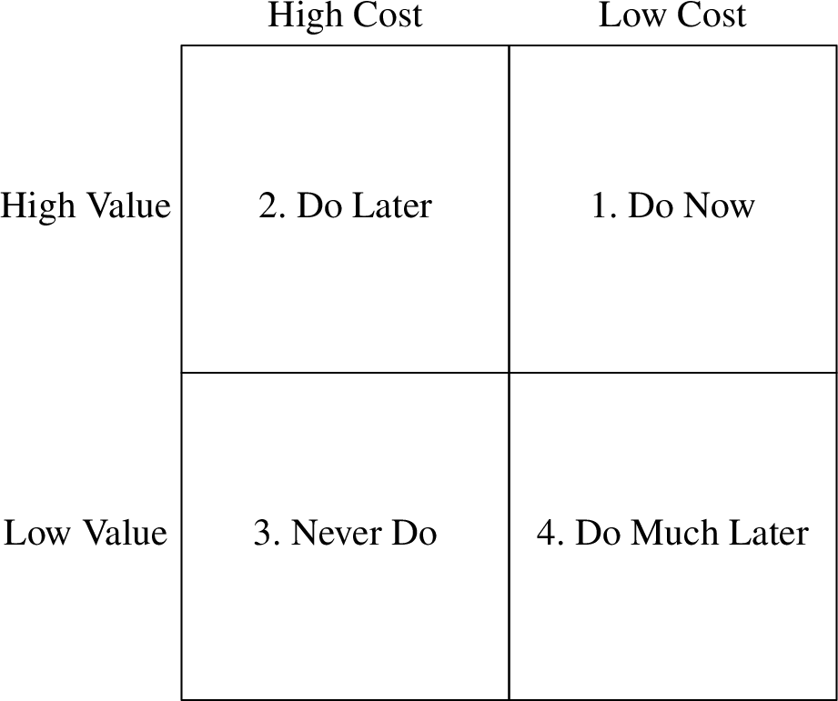

# Introduction to Agile

The _Agile Manifesto_ originated from the gathering of 17 software experts in
early 2001 as a reaction to heavy-weight processes like _Waterfall_. Since then,
Agile was adopted widely and has been extended in various ways—unfortunately,
not always in the spirit of the original idea.

## History of Agile

The basic idea of Agile—working with small, intermediate goals and measuring the
process—might be as old as civilization. Agile practices might also have been
used in the early days of software development. However, the idea of _Scientific
Management_, which is based on Taylorism, with its top-down approach and heavy
planning, was prevalent in many industries at that time, conflicting with the
_Pre-Agile_ practice then prevalent in software development.

Scientific Management was suitable for projects with a high cost of change, a
well-defined problem definition, and extremely specific goals. Pre-Agile
practices, on the other hand, were a good fit for projects with a low cost of
change, an only partially defined problem, and goals only being informally
specified.

Unfortunately, there was no discussion at that time on which approach was the
better fit for software projects. Instead, the Waterfall model—initially  used
as a straw man to be proven unsuitable by Winston Royce in his 1970 paper
_Managing the Development of Large Software Systems_—was widely adopted in the
industry. And Waterfall, with its emphasize on analysis, planning, and closely
sticking to a plan, was a descendant of Scientific Management, not of Pre-Agile
practices.

Waterfall dominated the industry since the 1970s for almost 30 years. Its
subsequent phases of analysis, design, and implementation looked promising to
developers working in endless "code and fix" cycles, lacking even the discipline
of Pre-Agile.

What looked good on paper—and produced promising looking results in the analysis
and design phases—often terribly failed in the implementation phase. Those
problems, however, have been attributed to bad execution, and the Waterfall
approach itself wasn't criticized. Instead, it became so dominant that new
developments in the software industry like structured or object-oriented
_programming_ were soon followed by the disciplines of structured and
object-oriented _analysis_ and _design_—perfectly fitting the Waterfall mindset.

Some proponents of those ideas, however, started to challenge the Waterfall
model in the mid-1990s, for example Grady Booch with his method of
object-oriented design (OOD), the _Design Pattern_ movement, and the authors of
the _Scrum_ paper. Kent Beck's _Extreme Programming_ (XP) and _Test-Driven
Development_ (TDD) approaches of the late 1990s clearly moved away from
Waterfall towards an Agile approach. Martin Fowler's take on _Refactoring_
emphasizing continuous improvement certainly is a bad fit for Waterfall.

## The Agile Manifesto

17 proponents of various agile ideas—Kent Beck, Robert C. Martin, Ward
Cunningham (XP), Ken Schwaber, Mike Beedle, Jeff Sutherland (Scrum), Andrew
Hunt, David Thomas ("Pragmatic Programmers"), among others—met in Snowbird, Utah
in early 2001 to come up with a manifesto capturing the common essence of all
those lightweight ideas. After two days, broad consensus was reached:

> We are uncovering better ways of developing software by doing it and helping
> others do it.
>
> - **Individuals and interactions** over processes and tools
> - **Working software** over comprehensive documentation
> - **Customer collaboration** over contract negotiation
> - **Responding to change** over following a plan

This _Agile Manifesto_ was published after the gathering on
[agilemanifesto.org](https://agilemanifesto.org/), where it still can be signed.
The [12
Principles](https://agilemanifesto.org/principles.html) were written as a
collaborative effort within the two weeks that followed the conference. This
document explains and directs the four values stated in the manifesto; it shows,
that those values have actual consequences.

## Agile Overview

Many software projects are managed using approaches based on faith and
motivational techniques. As a result, such projects are chronically late,
despite developers working overtime.

All projects are constrained by a trade-off called the _Iron Cross_: good, fast,
cheap, done—pick three! Good project managers understand this trade-off and
strive for results that are done good enough within an acceptable time frame and
budget, which provide the crucial features.

Agile produces data that helps managers taking good decisions. The _velocity_
shows the amount of points a development team finishes within an iteration. A
_burn-down chart_ shows the points remaining until the next milestone. The
latter not necessarily shrinks at the rate of the velocity, because requirements
and their estimations can change. Still, the burn-down chart's slope can be used
to predict a likely date when the milestone is going to be reached. Agile is a
feedback-driven approach. Even though the Agile Manifesto doesn't mention
velocity or burn-down charts, collecting such data and taking decisions based on
it is crucial. Make that data public, transparent, and obvious.

A project's end date is usually given and not negotiable, often for good
business reasons. The requirements, however, often change, because customers
only have a rough goal, but don't know the detailed steps how to reach it.

## A Waterfall Project

In the Waterfall days, a project was often split up into three pases of equal
length: analysis, design, and implementation. In the analysis phase,
requirements are gathered and planning is done. In the design phase, a solution
is sketched and the planning is refined. Neither phase has hard and tangible
goals; they are done when the end date of the phase is reached.

The implementation phase, however, needs to produce working software—a goal that
is hard and tangible, and whose attainment is easy to judge. Schedule slips are
only detected in this phase, and stakeholder only become aware of such issues
when the project should be done almost finished.

Such projects often end in a _Death March_: a hardly working solution is
produced after a lot of overtime work, despite deadlines being moved forward
repeatedly. The "solution" for the next project usually is to do even more
analysis and design—more of what didn't work in the first place (_Runaway
Process Inflation_).

## The Agile Way

Like Waterfall, an Agile projects starts with analysis—but analysis never ends.
The time is divided in iterations or sprints of typically one or two weeks.
_Iteration Zero_ is used to write the initial stories, to estimate them, to set
up the development environment, to draft a tentative design, and to come up with
a rough plan. Analysis, design, and implementation take place in every
iteration.

After the first iteration is completed, usually fewer stories have been finished
than originally estimated. This is not a failure, but provides a first
measurement that can be used to adjust the original plan. After a couple of
iterations, a realistic average velocity and an estimation of the project's
release date can be calcualted. This might be disappointing, but realistic. Hope
is replaced by real data early in the process.

Project management dealing with the Iron Cross—good, fast, cheap, done: pick
three!—can now do the following adjustments:

- _Schedule_: The end date is usually not negotiable, and if it is, delays
  usually cost the business significantly.
- _Staff_: _"Adding manpower to a late project makes it later."_ (Brooke's Law)
  If more staff is added to a project, productivity first plummets, and only
  increases over time. Staff can be added in the long run, if one can afford it.
- _Quality_: Lowering the quality might give the impression of going faster in
  the short run, but slows down the project in the long run, because more
  defects are introduced. _"The only way to go fast, is to go well."_
- _Scope_: If there's no other way, stakeholders can often be convinced to limit
  their demands to features that are absolutely needed.

Reducing the scope is often the only sensible choice. Make sure at the beginning
of every sprint to only implement features that are really needed by the
stakeholders. You might waste precious time on "nice to have" features
otherwise.

## Circle of Life

Extreme Programming (XP), as described in Kent Beck's _Extreme Programming
Explained", captures the essence of Agile. The practices of XP are organized in
the _Circle of Life_, which consists of three rings.

The outer ring contains the _business-facing_ practices, which are quite similar
to the Scrum process:

- **Planning Game**: breaking down a project into features, stories, and tasks
- **Small Releases**: delivering small, but regular increments
- **Acceptance Tests**: providing unambiguous completion criteria (definition of
  "done")
- **Whole Team**: working together in different functions (programmers, testers,
  management)

The middle ring contains the _team-facing_ practices:

- **Sustainable Pace**: making progress while preventing burnout of the
  developing team
- **Collective Ownership**: sharing knowledge on the project to prevent silos
- **Continuous Integration**: closing the feedback loop frequently and keeping
  the team's focus
- **Metaphor**: working with a common vocabulary and language

The inner ring contains _technical_ practices:

- **Pairing**: sharing knowledge, reviewing, collaborating
- **Simple Design**: preventing wasted efforts
- **Refactoring**: refining and improving all work products continuously
- **Test-Driven Development**: maintaining quality when going quickly

These practices closely match the values of the Agile Manifesto:

- **Individuals and interactions** over processes and tools
    - Whole Team (business-facing)
    - Metaphor (team-facing)
    - Collective Ownership (team-facing)
    - Pairing (technical)
- **Working software** over comprehensive documentation
    - Acceptance Tests (business-facing)
    - Test-Driven Development (technical)
    - Simple Design (technical)
    - Refactoring (technical)
    - Continuous Integration (technical)
- **Customer collaboration** over contract negotiation
    - Planning Game (business-facing)
    - Small Releases (business-facing)
    - Acceptance Tests (business-facing)
    - Metaphor (team)
- **Responding to change** over following a plan
    - Planning Game (business-facing)
    - Small Releases (business-facing)
    - Acceptance Tests (business-facing)
    - Sustainable Pace (team-facing)
    - Refactoring (technical)
    - Test-Driven Development (technical)

To sum up:

> Agile is a small discipline that helps small software teams manage small
> projects. Big projects are made from small projects.

# The Reasons for Agile

Many developers adopting Agile for the promise of speed and quality end up
disappointed as these results do not show up immediately. However, the more
important reasons for adopting Agile are _professionalism_ and _reasonable
customer expectations_.

## Professionalism

In Agile, high commitment to discipline is more important than ceremony.
Disciplined, professional behaviour becomes more important as software itself
becomes more important. Computers are almost everywhere nowadays, and so is
software. Little gets accomplished without software.

Software is written by programmers—and bad software can kill people. Therefore,
programmers will be blames as people are getting killed due to erroneous
software. The disciplines of Agile development are a first step towards
professionalism—which might save people's life in the long run.

## Reasonable Customer Expectations

Managers, customers, and users have reasonable expectations of software and its
programmers. The goal of Agile development is to meet t hose expectations, which
is not an easy task:

- **Do not ship bad software**: A system should not require from a user to think
  like a programmer. People spend good money on software—and should get high
  quality with few defects in return.
- **Continuous technical readiness**: Programmers often fail to ship useful
  software in time, because they work on too many features at the same time,
  instead of working only on the most important features first. Agile demands
  that a system must be technically deployable at the end of every iteration.
  The code is clean, and the tests all pass. Deploying or not—this is no longer
  a technical but a business decision.
- **Stable Productivity**: Progress usually is fast at the beginning of a
  project, but slows down as messy code accumulates. Adding people to a project
  only helps in the long run—but not at all if those new programmers are trained
  by those programmers that created the mess in the first place. As this
  downward spiral continues, progress comes to a halt. Developers demand to
  start again from scratch. A new code base is built—with the old, messy code
  base as the sole reliable source for requirements. The old system is
  maintained and further developed by one half of the team, and the other half
  lacks behind working on the new system; trying to hit a moving target. Big
  redesigns often fail, few are ever deployed to customers.
- **Inexpensive Adoptability**: Software ("soft"), as opposed to hardware
  ("hard") is supposed to be easy to change. Often seen as a nuisance by some
  developers, changing requirements are the reason why the discipline of
  software engineering exists. A good software system is easy to change.
- **Continuous Improvement**: Software should become better as time goes.
  Design, architecture, code structure, efficiency, and throughput of a system
  should improve and not detoriate over time.
- **Fearless Competence**: Developers are often afraid of modifying bad code,
  and therefor, bad code isn't improved. ("You touch it, you break it. You break
  it, you own it.") Test-Driven Development is helpful to overcome this fear by
  allowing for an automated quality assessment after every change to the code.
- **No QA Findings**: Bugs should not be discovered by QA, but avoided or
  eliminated by the development team in the first place. If the QA finds bugs,
  the developers must not only fix those, but also improve their process.
- **Test Automation**: Manual tests are expensive and, thus, will be reduced or
  skipped if the project's budget is cut. If development is late, QA has too
  little time to test. Parts of the system remain untested. Machines are better
  at performing repetetive tasks like manual testing than humans (except for
  exploratory testing). It is a waste of time and money to let humans perform
  manual tests; it's also immoral.
- **Cover for each other**: Developers must help each other; they must act as a
  team. IF somebody fails or gets sick, the other team members must help out.
  Every developer must ensure that others can cover for him or her by
  documenting the code, sharing knowledge, and helping others reciprocally.
- **Honest Estimates**: Developers must be honest with their estimates based on
  their level of knowledge. Under uncertainty, ranges ("5 to 15 days") rather
  than exact estimates ("10 days") should be provided. Tasks can't always be
  estimated exactly, but in relation to other tasks ("this takes twice as long
  as that").
- **Saying "No"**: If no feasible solution for a problem can be found, the
  developer must say so. This can be inconvenient, but could also save bigger
  trouble down the road.
- **Continuous Learning**: Developers must keep up with an ever and fast
  changing industry by learning all the time. It's great if a company provides
  training, byt the responsibility for learning remains with the developer.
- **Mentoring**: Existing team members must teach new team members. Both sides
  learn in the process, because teaching is a great way of learning.

## The Bill of Rights

Agile is supposed to heal the divide between business and development. Both
sides—customers and developers—have complementary rights.

Customers have the right to …

- … an overall plan: what can be accomplished when at what cost?
- … get the most out of every iteration.
- … see progress in terms of passing tests they define.
- … change their minds and priorities.
- … be informed on schedule and estimate changes.
- … cancel at any time and remain with a working system nonetheless.

Developers have the right to …

- … know what is needed, and what the priorities are.
- … produce high-quality work.
- … ask for and receive help.
- … update their estimates.
- … accept responsibilities rather than having them assigned.

Agile is not a process, it is a set of _rights, expectations, and disciplines_
that form the basis for an ethical profession.

# Business Practices

Development must follow the business-facing practices of Planning, Small
Releases, Acceptance Tests, and Whole Team in order to succeed.

## Planning

A project can be planned by breaking it up into its pieces recursively and
estimating those pieces. The more those pieces are broken up—down to individual
lines of code in the extreme case—the more accurate and precise the estimate
becomes, but the more time it takes to come up with this estimation. An estimate
should be as accurate as possible, but only as precise as necessary.

By giving a range of time (e.g. 5-15 days) instead of an exact duration (e.g. 10
days), an estimate can be imprecise, but still accurate. A _trivariate
estimation_ gives a best-case, a nominal-case, and a worst-case for a task to be
finished with a probability of 5%, 50%, or 95%, respectively.

For example, a task estimated to take 8 (best-case), 12 (nominal-case), and 16
(worst-case) days has a 5% chance of finishing within 8 days, a 50% chance of
finishing within 12 days, and a chance of 95% to finish within 16 days. To put
it differently: Given 100 similar tasks, 5 will be completed within the
best-case, 50 within the nominal-case, and 95 within the worst-case estimate.

### User Stories and Story Points

This technique works well for long-term planning, but is too imprecise for
day-to-day planning within a project. For this purpose, a technique based on an
iteratively calibrating feedback loop is used: _Story Points_.

A _user story_ is written from the user's perspective and describes a feature of
the system to be developed, for example: "As a user, I want to be asked if I
want to save my document when I close the application without saving." The
details are left out at first and will be clarified as the developers are taking
the story up for development.

Despite modern technology, writing those stories on index cards lets you
physically _handle_ those stories in meetings, which can be highly valuable.
Index cards impose a certain discipline of keeping the stories vague, so that
the planning process isn't bogged down by too much detail. The cards also must
not become too valuable for being discarded.

The story cards written in Iteration Zero are estimated in an informal meeting,
which takes place regularly, usually at the beginning of every sprint. Writing
and estimating stories is an ongoing process. Estimation starts by picking a
story of average size, to which an average number of story points is assigned,
say, 3 story points when working with a range of 1-5 story points.

Other stories are compared in size against this _Golden Story_ and assigned
story points accordingly. The story points estimated are written on the story's
index card.  Those points do _not_ map to units of time! Different developers
would spend a different amount of time for implementing the same story.
Fortunately, those differences even out as a lot of stories are implemented over
the course of many sprints thanks to the _Law of Large Numbers_.

### Iteration Planning

An iteration starts with the _Iteration Planning Meeting_ (IPM), which should
not take up more time than one twentieth of the total iteration, i.e. at most
half a day for a two week iteration. The whole team—stakeholders, programmers,
testers, business analysts, project managers—attend the IPM.

The programmers estimate their velocity for the upcoming iteration, i.e. how
many story points they think they can complete. This is a rough guess and
probably way too high for the first iteration. The stakeholders choose the
stories to fit in within the velocity estimated by the programmers. This
estimate is _not_ a commitment!

The stakeholders play the _four-quadrant game_ to pick the right stories, i.e.
those with the highest return on invest (ROI). Along the two axes of cost and
value, each story can be put in one of four quadrants:

{width=921px}

1. Valuable, but cheap: those stories should be done right away.
2. Valuable, but expensive: those stories should be done later on.
3. Not valuable, but expensive: don't do this stories, discard them.
4. Not valuable, but cheap: consider doing those stories later.

At the midpoint of the iteration, half of the story points should be done. If
less are done, which is to expect from the first iteration, the iteration is
_not_ a failure, because it generates valuable data. The first half of the
iteration is a good prediction for its second half in terms of velocity, like
today's weather is the best predictor for tomorrow's weather. Likewise, the
current iteration's velocity is also a good predictor for next iterations's
velocity.

The project ends if no more stories worth implementing in terms of their ROI can
be gathered for another iteration.

### INVEST Stories

User stories do not describe features in detail, they are rather a reminder of
features. The acronym INVEST stands for simple guidelines to be followed when
writing stories:

- **I**: _Independent_. User stories don't have to be implemented in a particular
  order, because they are independent of each other. Even though dependencies
  cannot be avoided sometimes, they should be kept at a minimum, so that stories
  can be implemented in the order of their business value.
- **N**: _Negotiable_. User stories should leave space for negotiations between
  business and development. Those negotiations can help to keep the cost low by
  agreeing on simple features ans easy implementations.
- **V**: _Valuable_. User stories must create clear and quantifiable value to
  the business. Soft quantifications like high/medium/low are fine, as long as
  stories can be compared in terms of their business value. Such stories usually
  cut through all layers: from frontend over backend to the database and
  middleware. Architecture, refactoring, and cleanup tasks are not user stories!
- **E**: _Estimable_. User stories must be concrete enough in order to be
  estimated by the developers. However, stories must still be negotiable, so aim
  for the sweet spot between specificy and vagueness by being precise about the
  business value while leaving out implementation details.
- **S**: _Small_. User stories should be small enough so that they can be
  implemented by one or two developers within a single iteration. A good rule of
  thumb is to pick roughly the same number of stories for an iteration as there
  are developers on the team.
- **T**: _Testable_. User stories should be accompanied by tests specified by
  the business. A story is complete when all of its tests pass. Tests are
  usually written by QA and automated by the developers. Specifying the tests
  can happen later than the actual story is written.

### Story Estimation

There are different ways to estimate user stories. _Flying Fingers_ is the
simplest: After reading and discussing a story, developers hold up the amount of
fingers corresponding to their estimation of story points. They do so behind
their backs, and all hands are shown on the count of three.

_Planning Poker_ is a similar approch based on numbered cards denoting story
points. Some decks use a Fibonacci series (1, 2, 3, 5, 8), sometimes with
additional indications: infinity (∞) for stories too big for estimation, a
question mark (?) if there's not enough information available to estimate a
story, and zero (0) if the story is too trivial for estimation.

As fingers or cards are revealed, there might be a consensus, in which case the
common number is written on the index card. If there is a big deviation, those
differences are being discussed, followed by another round of estimation, until
a consensus can be reached.

Stories too trivial for estimation (0) can be combined by stapling those index
cards together. Here, multiple zeros can indeed add up to something more than
zero. Stories too big (∞) can be split up as long they comply to the INVEST
guidelines.

Stories too unclear for estimation (?) often require additional research. A
meta-story—a so-called _spike_, cutting a very thin slice through the sytem—is
created and referred to as a dependency of the original, unclear story.

### Iteration and Release

An iteration produces data by getting stories done. The focus should be on
finishing entire stories rather than tasks within stories: better 80% of stories
completely done than 80% of the tasks for each story done. Stories are  not
assigned to programmers, but picked individually or by negotiating within the
developer team. Experienced programmers should guide rookies away from picking
up too many or too heavy stories.

QA should start writing the acceptance tests right after the IPM, so that they
are finished up to the midpoint of the iteration. Developers can help in the
process, but not the same developer should be responsible for implementing a
story and writing the acceptance tests for it. However, QA and developers should
work closely together on the acceptance tests. A story is done when all of its
acceptance tests pass.

At the end of every iteration, a demo is given to the stakeholders. The newly
added features and passing acceptance tests—both old and new—should be shown.
After the demo, velocity and burn-down charts are updated. Noisy at the
beginning, the velocity will average out after a few iterations.

A rising velocity can hint to story point inflation: as pressure is put on the
development team to get more done, developers start assigning more points to
their stories. Velocity is a measurement and not an objective; don't put
pressure on something you measure!

A falling velocity likely points to bad code quality, dragging further
development down. If too few unit tests are written, developers become hesitant
refactoring the code. As pressure builds up, developers will be tempted to
inflate story points. Keep in mind the Golden Story of the initial iteration to
countersteer.

Release as often as possible. The goal of continuous delivery is to release to
production after every change. Historically, those cycles were long because of
long technical turnover times (testing, checking out code). With modern source
code management systems, working with optimistic locks, checkout time approaches
zero, and Continuous Delivery becomes possible. Old organizations must adjust
their processes accordingly to overcome their inertia, which requires cultural
change.

## Acceptance Tests

_Acceptance Tests_ are based on the idea that requirements should be specified
by the business. The word "specify" has different meanings, deponding on who's
using it: business wants to keep the specification somewhat vague in natural
language, whereas programmers prefer a specification as precise as needed for a
machine to execute it.

The solution to this conflict is that business specifies a test in a natural
language, but using a formal structure like _Given, When, Then_ (as used in
_Behaviour-Driven Development_, BDD). Developers then implement those tests
using their programming language. Those tests become the "Definition of Done"
for the user story.

- A story is not specified until its acceptance tests are written.
- A story is not completed until its acceptance tests pass.

Business people usually define the "happy path", which shows that the system
produces the intended value. QA extends those tests with the "unhappy paths",
because they are good at finding corner cases and ways a user might break the
system.

QA no longer is the bottleneck at the end of the iteration, but deeply involved
from the beginning. Finding lots of bugs at the end of the iteration is no
longer considered proof of QA doing its job properly. Instead, QA supplies test
specifications to development, and development makes sure that those tests all
pass. This process of running the tests should be automated, of course.

## Whole Team

The _Whole Team_ practice used to be called _On-Site Customer_. It is based on
the idea that reducing physical distance improves communication. "Customer" is
meant in a broad sense: it can describe a stakeholder of a project or a Scrum
Product Owner.

Having the whole project team sitting in the same room not only makes
communication more efficient, it also creates serendipity: People in different
roles will get together by mere chance (watercooler, coffee machine). Hopefylly,
those unplanned interactions create synergy within the team.

The advantages of co-location—better communication, serendipity—fall off in
outsourcing settings. As the distance—physical, cultural, in terms of language,
and time zone—becomes bigger, communication tends to get worse. Technology has
improved, however, and working remotely works quite well nowadays, especially
if there's only a gap in space, but none in terms of culture, language, and
time zone. Serendipituous conversation and nonverbal communication,  however,
are significantly reduced in a remote setting.

# Team Practices

Agile's Team Practices are all about the relationships of the individual team
members to one another and with the product they are building. Those are
_Metaphor_, _Sustainable Pace_, _Collective Ownership_, and _Continuous
Integration_.

## Metaphor

Effective communication within a team requires a common language, including a
well-defined vocabulary of terms and concepts. Using metaphors, e.g. comparing a
multi-step process with an assembly line, can improve communication both within
the team and with the customer. Silly and bad metaphors, on the other side, can
be embarassing or even insulting towards the stakeholders.

The term _Ubiquitous Language_, coined by Eric Evans in his book _Domain-Driven
Design_, very well defines what a team needs: a model of the problem domain,
described by a commonly accepted vocabulary, i.e. by programmers, QA, managers,
customers, users—everyone involved with the project.

## Sustainable Pace

Working long hours can make programmers feel proud of themselves. They are
valuable and needed, after all, and sometimes a project is saved by working
overtime. Unfortunately, this well intended dedication can lead to burnout, with
long-term negative effects for both programmer and employer.

Judgement is often impeded when working late at night after a full working day;
often grave mistakes are made and bad decisions are taken at that point.

A software project is more like a marathon than a sprint or a series of sprints,
and therefor must be approached at a sustainable pace. If there's spare energy
just before the finish line, it's ok to sprint for this last stretch.

Developers must not comply when asked by the management to go faster. Working a
lot of overtime is not a demonstration of dedication to the employer, but a
consequence of bad planning, and often the result of manipulable developers
being coerced into agreeing on unrealistic deadlines.

Programmers should figure out how many hours of sleep they need, and make it a
priority to consistently get that amount of sleep.

## Collective Ownership

In an Agile project, code is not owned by individuals, but collectively, i.e. by
the team as a whole. Even though specialization is allowed and becomes a
necessity as the system grows, the ability to work outside of one's speciality
must be maintained.

The need for generalization in a system grows with its code base. But
generalization can only be achieved by developers seeing the big picture. With
Collective Ownership, knowledge is distributed across the team, which then
becomes better at communicating and making decisions.

Teams practicing individual code ownership with strong barriers to modifying or
even reading other's code often become dysfunctional. Finger pointing and
miscommunication become rampant in such teams. Code solving the same problem is
written multiple times rather than shared.

## Continuous Integration

The practice of _Continuous Integration_ initially consisted of checking in
source code and merging it with the main line every couple of hours. Feature
toggles are used to hide changes that were already deployed, but should not be
active yet. Later, the introduction of _Continuous Build_ tools, which run all
the tests automatically as code is check in, shortened this cycle to minutes.

Programmers should run all the tests locally before checkin in code, so that the
continuous build never breaks. If the build breaks nonetheless, it's the highest
priority for the entire team to get it running and the tests passing again. Once
discipline slips and the build is left in a broken state, the team very unlikely
will make the effort to "catch up later". As a consequence, broken systems will
be deployed sooner or later.

## Standup Meetings

The _Standup Meeting_ or _Daily Scrum_ is optional. It can be held less often
than daily, at whatever schedule it fits the team best. The meeting should take
roughly ten minutes, no matter how big the team is.

The team members stand in a circle and answer the following questions:

1. What did I do since the last meeting?
2. What will I do until the next meeting?
3. What is in my way?

No discussions are held, no explanations are given, no complaints are made.
Every developer gets half a minute. If people other than developers take part,
they either should only listen or talk according to the same rules as the
developers.

_The Chicken and the Pig_ is a fable that demonstrates why non-developers—the
chickens, making a small sacrifice to provide eggs—and developers—the pigs,
sacrificing their life to provide meat—should not have the same weight in making
decisions about the (menu) plan.

# Technical Practices

The technical practices of Agile reach deep into the programmer's behaviour when
writing code, by adding a set of rituals considered absurd by many programmers.
Those practices at the very core of Agile are: _Test-Driven Development_,
_Refactoring_, _Simple Design_, and _Pair Programming_.

## Test-Driven Development

Programming is a lot like accounting: a single little mistake can have huge
negative consequences. Therefor, accountants developed _double-entry
bookkeeping_, which requires every transaction being entered twice into the
book: once on the credit side, and once on the debit side. The sums of each
account from both sides are collected in the balance sheet. The differences of
the credit and debit side must amount to zero, otherwise a mistake has been
made. Such mistakes can be detected quickly, if the transactions are entered one
at a time, and the difference of both sides is checked to remain zero after
every entered transaction.

_Test-Driven Development_ (TDD) is the corresponding technique for programming.
Every required behaviour of the program is entered twice: once as test code, and
once as production code. Behaviours are added one by one: first as a (yet
failing) test, second as working production code making that test pass. As in
accounting, a result of zero is to be achieved: zero failing tests. Like this,
mistakes can be caught as they'd enter the code base—and be avoided in time.
Unlike double-entry bookkeeping, TDD is not (yet?) required by law.

TDD can be described with the following three simple rules:

1. Do not write production code until you have test code failing due to the
   lack of that very production code.
2. Do not write more test code than needed to fail the test—with compiler errors
   counting as failing.
3. Do not write more production code than needed to make the test pass.

When sticking to those rules, programmers oscillate between test and production
code at a rate of just a few seconds. What looks like a distraction at the
beginning will ensure that everything works—or at least worked just a minute
ago. The code that introduced the error is easy to detect: it must be among the
few lines that just have been written.

Some programmers are very good at working with debuggers, because they've spent
a lot of time debugging. You only need to debug a lot, if you have a lot of
bugs. With TDD, less bugs are introduced, so it's ok for developers sticking to
the discipline of TDD to be bad at operating debuggers. (Debugging is still
required now and then, but much less often.)

A comprehensive test suite is the best kind of documentation for programmers:
working, self-contained, small code examples.

Writing tests after the fact for code that already has been tested manually
feels like boring busy work. It's more fu to test and program according to the
three rules of TDD. Code having been written under the rules of TDD is designed
for testability. Writing tests for production code not designed for testability
is hard—and therefor likely to be left away. This leaves holes in the test
suite, and a passing test suite can no longer be trusted. However, a good test
suite that passes should be the go ahead for deployment.

Though desirable, a high test coverage of, say, 90% and above, is not a metric
for management, but for the development team. It requires a strong understanding
of the code base in order to interpret the test coverage metric in a meaningful
way. Enforcing high test coverage by the means of builds failing for a coverage
deemed too low is counterproductive, because it incentivises programmers to
write bogus tests without meaningful assertions.

The ultimate goal of TDD is _courage_, not coverage: Programmers with trust in
their test suite fearlessly modify and improve existing code. Developers lacking
that kind of trust will shy away fro cleaning up messy code; the code base
begins to rot. If the code becomes unmaintainable, further development becomes
harder and, ultimately, comes to a halt. TDD, on the other hand, keeps the code
orderly and gives the programmers confidence for further development.
