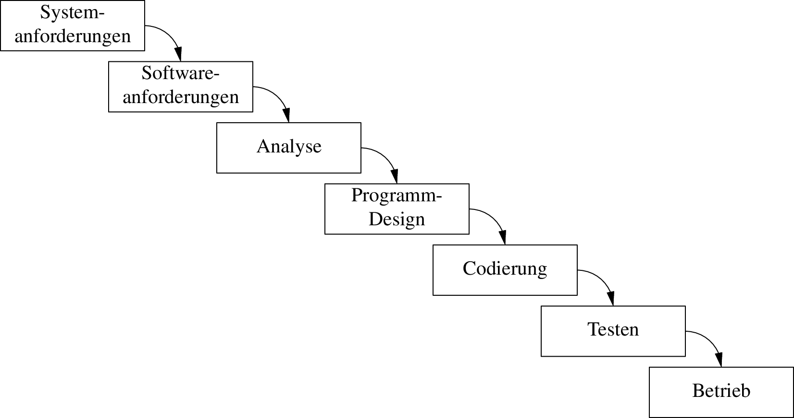
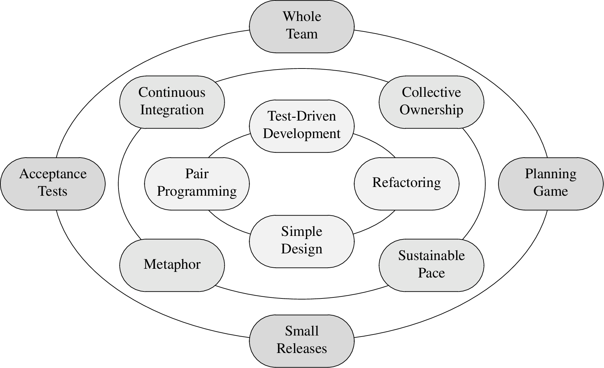

**Hinweis zur Übersetzung:** Hierbei handelt es sich um die deutschsprachige
Übersetzung einer englischsprachigen Buchzusammenfassung, die über das
englischsprachige Original geschrieben worden ist. Manche Begriffe wurden frei
auf Deutsch übersetzt, andere im englischen Original belassen. Auf eigene
Übersetzungen folgt beim ersten Auftreten jeweils der Originalbegriff in
Klammern.

Im Englischen wurde der Begriff "agile software development" mit "Agile"
abgekürzt. Deshalb steht auch in dieser Übersetzung der substantivierte Begriff
"Agile" geschrieben, der englisch auszusprechen ist, wo "agile
Softwareentwicklung" gemeint ist.

# Einführung in Agile

Das _Manifest für Agile Softwareentwicklung_ (_Agile Manifesto_) ist das
Ergebnis eines Treffens von 17 Experten für Software anfangs 2001 als Reaktion
auf schwergewichtige Prozesse wie Wasserfall (_Waterfall_). Seither erfreute
sich Agile weiter Verbreitung und wurde auf verschiedene Arten erweitert ‒
leider nicht immer im Sinne der ursprünglichen Idee.

## Geschichte von Agile

Die grundlegende Idee von Agile ‒ die Arbeit mit kleinen Zwischenzielen, wobei
der Fortschritt gemessen wird ‒ könnte so alt sein wie unsere Zivilisation. Es
ist auch möglich, dass agile Praktiken in den Anfängen der Softwareentwicklung
verwendet worden sind. Die Idee des wissenschaftlichen Managements (_Scientific
Management_), welche auf dem Taylorismus basiert, von oben herab organisiert ist
und auf eine detaillierte Planung setzt, war zu dieser Zeit weit verbreitet in
der Industrie, wodurch sie in Konflikt zu den vor-agilen (_Pre-Agile_) Praktiken
stand, die zu dieser Zeit in der Softwareentwicklung so weit verbreitet waren.

Wissenschaftliches Management war für Projekte geeignet, bei denen Änderungen
teuer waren und zu denen es eine genau definierte Problemdefinition mit extrem
spezifischen Zielen gab. Vor-agile Praktiken andererseits eigneten sich gut für
Projekte, bei denen Änderungen günstig, das Problem nur teilweise definiert und
die Ziele informell spezifiziert waren.

Leider gab es zu dieser Zeit keine Diskussion darüber, welcher Ansatz für
Softwareprojekte der bessere war. Stattdessen fand das Wasserfallmodell weite
Verbreitung, das ursprünglich von Winston Royce in seinem Fachartikel _Managing
the Development of Large Software Systems_ als Strohmannargument aufgebaut
worden war, um dessen Unzulänglichkeit zu demonstrieren. Das Wasserfallmodell
mit seinem Fokus auf Analyse, Planung und genaues Einhalten von Plänen war ein
Abkömmling des wissenschaftlichen Managements, nicht von vor-agilen Praktiken.

{width=90%}

Das Wasserfallmodell dominierte die Industrie ab den 1970er-Jahren für fast 30
Jahre. Seine aufeinanderfolgenden Phasen von Analyse, Design und Umsetzung
sah vielversprechend aus für Entwickler, welche in endlosen "Programmieren und
Korrigieren"-Zyklen (_"code and fix" cycles_) arbeiteten, und dabei nicht einmal
die vor-agile Disziplin aufbrachten.

Was auf dem Papier gut aussah ‒ und zu vielversprechenden Ergebnissen nach der
Analyse- und Design-Phase führte ‒ scheiterte oft kläglich in der
Umsetzungsphase. Diese Probleme wurden jedoch auf eine schlechte Ausführung
geschoben, und der Wasserfall-Ansatz selber wurde nicht kritisiert. Stattdessen
wurde dieser Ansatz so dominant, dass auf neue Entwicklungen in der
Software-Industrie wie strukturierte oder objektorientierte Programmierung bald
die Disziplinen der strukturierten und objektorientierten Analyse und des
strukturierten und objektorientierten Designs folgten ‒ und so perfekt zur
Wasserfall-Denkweise passten.

Einige Befürworter dieser Ideen begannen jedoch das Wasserfallmodell mitte der
1990er-Jahre in Frage zu stellen, wie z.B. Grady Booch mit seiner Methode des
objektorientierten Designs (OOD), die Entwurfsmuster-Bewegung (_Design Pattern
movement_), und die Autoren des _Scrum_-Papers. Kent Becks Ansätze des _Extreme
Programming_ (XP) und der testgetriebenen Entwicklung (_Test-Driven Development,
TDD_) der späten 1990er-Jahre waren eine klare Abkehr vom Wasserfallmodell hin
zu einem agilen Ansatz. Martin Fowlers Gedanken zum _Refactoring_ mit dessen
Betonung von kontinuierlicher Verbesserung passt sicherlich schlecht zum
Wasserfallmodell.

## Das Manifest für Agile Softwareentwicklung

17 Vertreter verschiedener agiler Ideen ‒ Kent Beck, Robert C. Martin, Ward
Cunningham (XP), Ken Schwaber, Mike Beedle, Jeff Sutherland (Scrum), Andrew
Hunt, David Thomas ("Pragmatic Programmers") und weitere ‒ trafen sich anfangs
2001 in Snowbird, Utah, um ein Manifest zu erarbeiten, dass die gemeinsame
Essenz all dieser leichtgewichtigen Ideen erfassen sollte. Nach zwei Tagen
konnte ein breiter Konsens erreicht werden:

> Wir erschließen bessere Wege, Software zu entwickeln, indem wir es selbst tun
> und anderen dabei helfen.  Durch diese Tätigkeit haben wir diese Werte zu
> schätzen gelernt:
>
> - **Individuen und Interaktionen** mehr als Prozesse und Werkzeuge
> - **Funktionierende Software** mehr als umfassende Dokumentation
> - **Zusammenarbeit mit dem Kunden** mehr als Vertragsverhandlung
> - **Reagieren auf Veränderung** mehr als das Befolgen eines Plans
>
> Das heißt, obwohl wir die Werte auf der rechten Seite wichtig finden, schätzen
> wir die Werte auf der linken Seite höher ein.

Das _Manifest für Agile Softwareentwicklung_ wurde nach dem Treffen auf
[agilemanifesto.org](https://agilemanifesto.org/iso/de/manifesto.html)
veröffentlicht, wo es noch immer unterschrieben werden kann. Die [12 Prinzipien
hinter dem Agilen Manifest](https://agilemanifesto.org/iso/de/principles.html)
wurden nach den beiden Wochen, die auf das Treffen folgten, in gemeinsamer
Arbeit verfasst. Dieses Dokument erläutert die vier Werte, die im Manifest
aufgeführt sind, und verleiht ihnen eine Richtung; es legt dar, dass diese Werte
wirkliche Konsequenzen haben.

## Überblick über Agile

Viele Softwareprojekte werden mit einem Ansatz basierend auf Zuversicht und
Motivationstechniken geführt. Das Ergebnis ist, dass solche Projekte chronisch
verspätet sind, obwohl die Entwickler Überstunden leisten.

Alle Projekte sind eingeschränkt von einem Kompromiss, den man als das _eiserne
Kreuz des Projektmanagements_ (_Iron Cross of Project Management_) bezeichnet:
gut, schnell, günstig, fertig ‒ wähle drei! Gute Projektmanager verstehen diesen
Kompromiss und streben nach Ergebnissen die gut genug sind, in einem akzeptablen
Zeitrahmen und Budget erreicht werden können und die wesentlichen Features
bieten.

Agile produziert Daten, welche Managern dabei helfen gute Entscheidungen zu
treffen. Die _Velocity_ zeit die Menge der Punkte, die ein Entwicklungsteam
innerhalb einer Iteration abarbeitet. Ein _Burn-Down Chart_ zeigt die
verbleibenden Punkte bis zur Erreichung des nächsten Meilensteins. Dieses
schrumpft nicht notwendigerweise mit der Geschwindigkeit der Velocity, weil
Anforderungen und deren Schätzung sich ändern können. Trotzdem kann das Gefälle
des Burn-Down Charts dazu verwendet werden, um ein wahrscheinliches
Release-Datum für den nächsten Meilenstein vorherzusagen.

Agile ist ein Ansatz, der auf Rückkoppelung basiert (_feedback-driven
approach_). Auch wenn im Agile-Manifest weder Velocity noch Burn-Down Charts
erwähnt werden, ist das Sammeln solcher Daten und das Treffen von Entscheidungen
auf dieser Grundlage entscheidend. Solche Daten sollen öffentlich,
offensichtlich und transparent gemacht werden.

Das Enddatum eines Projekts ist normalerweise gegeben und kan nicht verhandelt
werden, oft aus guten Gründen des Geschäftsinteresses. Die Anforderungen ändern
sich hingegen häufig, weil Kunden nur ein grobes Ziel haben, aber nicht die
genauen Schritte kennen, um dieses zu erreichen.

## Ein Wasserfall-Projekt

Zu Zeiten des Wasserfallmodells wurde ein Projekt oft in drei Phasen gleicher
Länge aufgeteilt: Analyse, Design und Umsetzung. In der Analysephase wurden
Anforderungen gesammelt und die Planung wurde durchgeführt. In der Designphase
wurde eine Lösung skizziert und die Planung verfeinert. Keine der beiden Phasen
haben harte und greifbare Ziele; sie waren abgeschlossen, wenn das Enddatum der
Phase erreicht worden war.

Die Umsetzungsphase muss jedoch funktionierende Software hervorbringen ‒ ein
hartes und greifbares Ziel, dessen Erreichung einfach zu beurteilen ist.
Verspätungen sind oft erst in dieser Phase zu erkennen, und Anspruchsgruppen
(_Stakeholders_) erfahren erst von solchen Problemen, wenn das Projekt
eigentlich schon beinahe fertig sein sollte.

Solche Projekte enden häufig in einem _Todesmarsch_ (_Death March_): eine kaum
funktionierende Lösung wird nach vielen Überstunden herausgebracht, obwohl die
Abgabefrist (_Deadline_) mehrmals verschoben worden ist. Die "Lösung" für das
nächste Projekt besteht normalerweise darin, dass noch mehr Analyse und Design
gemacht wird ‒ mehr von dem, was schon vorher nicht funktioniert hat (_Runaway
Process Inflation_).

## Der agile Ansatz

Wie beim Wasserfallmodell beginnt auch ein agiles Projekt mit der Analyse ‒ doch
die Analyse ist nie fertig. Die Zeit wird in Iterationen oder _Sprints_ von
normalerweise zwei Wochen eingeteilt. Die _Iteration null_ (_Iteration Zero_)
wird dazu verwendet, die anfänglichen Stories zu schreiben und zu schätzen,
sowie um die Entwicklungsumgebung aufzusetzen, ein vorläufiges Design zu
entwerfen, und einen groben Plan zu machen. Analyse, Design und Umsetzung finden
in jeder Iteration statt.

Nach Abschluss der ersten Iteration sind normalerweise weniger Stories
abgeschlossen worden als ursprünglich geschätzt. Das ist kein Misserfolg,
sondern bietet eine erste Messung, die zur Anpassung des ursprünglichen Plans
verwendet werden kann. Nach ein paar Iterationen kann eine realistische
Durchschnittsvelocity berechnet und eine Schätzung des Releasedatums abgegeben
werden. Das mag oft enttäuschend ausfallen, ist aber wenigstens realistisch.
Hoffnung wird schon früh durch echte Daten ersetzt.

Das Projektmanagement, dass sich mit dem eisernen Kreuz befassen muss ‒ gut,
schnell, günstig, fertig: wähle drei! ‒ kann nun die folgenden Anpassungen
vornehmen:

- _Planung_ (_Schedule_): Das Abschlussdatum ist gewöhnlich nicht verhandelbar,
  und wenn es das ist, entstehen der Firma bei Verspätungen normalerweise
  signifikante Kosten.
- _Personal_ (_Staff_): _"Durch das Hinzufügen von Arbeitskräften zu einem
  verspäteten Projekt verspätet sich das Projekt nur noch mehr._ (Brookes
  Gesetz, _"Adding manpower to a late project makes it later."_) Wenn einem
  Projekt mehr Personal zugewiesen wird, fällt die Produktivität zunächst stark
  ab, und verbessert sich erst nach längerer Zeit. Personal kann langfristig
  aufgestockt werden, sofern man es sich finanziell leisten kann.
- _Qualität_ (_Quality_): Die Qualität zu senken mag zwar kurzfristig den
  Eindruck vermitteln, dass man schneller vorwärts kommt. Langfristig wird aber
  dadurch das Projekt verzögert, weil mehr Fehler eingebaut werden. _"Die
  einzige Möglichkeit schnell voranzukommen, ist gut voranzukommen."_ (_"The
  only way to go fast, is to go well."_)
- _Umfang_ (_Scope_): Wenn es keine andere Möglichkeit gibt, können die
  Anspruchsgruppen oft davon überzeugt werden, ihre Anforderungen auf Features
  einzuschränken, die unbedingt notwendig sind.

{width=1202px}

Die Reduktion des Umfangs ist oftmals die einzige vernünftige Wahl. Darum soll
man zu Beginn eines jeden Sprints sicherstellen, dass dabei nur Features
umgesetzt werden, die für Anspruchsgruppen wirklich wichtig sind.  Andernfalls
läuft man Gefahr wertvolle Zeit in optionale Features (_"nice to have
features"_) zu investieren.

## Der Kreis des Lebens

Extreme Programming (XP), wie es in Kent Becks _Extreme Programming Explained_
beschrieben ist, erfasst die Essenz der agilen Softwareentwicklung. Die
Praktiken von XP sind im _Kreis des Lebens_ (_Circle of Life_) organisert,
welcher aus drei Ringen besteht. (Die übersetzten Begriffe werden hier nur
ergänzend angegeben. Im weiteren Text werden die Originalbegriffe verwendet, da
diese im deutschsprachigen Raum geläufig sind, zumindest in der
Softwareentwicklung.)

{width=90%}

Der äussere Ring beinhaltet die geschäftsorientierten (_business-facing_)
Praktiken, welche ziemlich ähnlich sind wie der Scrum-Prozess:

- **Planning Game** (Planungsspiel): das Projekt in Features, Stories und
  Aufgaben herunterbrechen
- **Small Releases** (kleine Releases): kleine, aber regelmässige Inkremente
  ausliefern
- **Acceptance Tests** (Akzeptanztests): unmissverständliche Abschlusskriterien
  angeben (_definition of "done"_)
- **Whole Team** (Team als Ganzes): in verschiedenen Funktionen (Programmierer,
  Tester, Management) zusammenarbeiten

Der mittlere Ring beinhaltet die teamorientierten (_team-facing_) Praktiken:

- **Sustainable Pace** (nachhaltiges Tempo): Fortschritt machen und dabei das
  Ausbrennen (_burnout_) des Entwicklugsteams verhindern
- **Collective Ownership** (gemeinsamer Besitz): Wissen über das Projekt
  austauschen, um Wissenssilos zu vermeiden
- **Continuous Integration** (kontinuierliche Integration): häufiges Schliessen
  des _feedback loops_ und den Fokus des Teams aufrechterhalten
- **Metaphor** (Metapher): mit einem gemeinsamen Wortschatz und mit einer gemeinsamen
  Sprache arbeiten

Der innere Ring beinhaltet die technischen (_technical_) Praktiken:

- **Pair Programming**/**Pairing** (paarweises Programmieren): Wissen
  austauschen, Reviews durchführen, zusammenarbeiten
- **Simple Design** (einfaches Design): unnötige Aufwände vermeiden
- **Refactoring** (Überarbeitung): alle Arbeitserzeugnisse kontinuierlich
  verbessern
- **Test-Driven Development** (testgetriebene Entwicklung): die Qualität beim
  schnellen Fortschreiten hoch halten

Diese Praktiken haben eine gute Übereinstimmung zu den agilen Werten aus dem
Manifest:

- **Individuen und Interaktionen** mehr als Prozesse und Werkzeuge
    - Whole Team (geschäftsorientiert)
    - Metaphor (teamorientiert)
    - Collective Ownership (teamorientiert)
    - Pair Programming/Pairing (technisch)
- **Funktionierende Software** mehr als umfassende Dokumentation
    - Acceptance Tests (geschäftsorientiert)
    - Test-Driven Development (technisch)
    - Simple Design (technisch)
    - Refactoring (technisch)
    - Continuous Integration (technisch)
- **Zusammenarbeit mit dem Kunden** mehr als Vertragsverhandlung
    - Planning Game (geschäftsorientiert)
    - Small Releases (geschäftsorientiert)
    - Acceptance Tests (geschäftsorientiert)
    - Metaphor (teamorientiert)
- **Reagieren auf Veränderung** mehr als das Befolgen eines Plans
    - Planning Game (geschäftsorientiert)
    - Small Releases (geschäftsorientiert)
    - Acceptance Tests (geschäftsorientiert)
    - Sustainable Pace (teamorientiert)
    - Refactoring (technisch)
    - Test-Driven Development (technisch)

Zusammenfassend:

> Agile ist eine kleine Disziplin, welche kleinen Software-Teams beim Handhaben
> kleiner Projekte hilft. Grosse Projekte werden aus kleinen Projekten gemacht.

# Gründe für Agile

Viele Entwickler, die aufgrund des Versprechens von Geschwindigkeit und Qualität
auf Agile umsteigen, sind enttäuscht, wenn sich diese Ergebnisse nicht sofort
einstellen. Die wichtigeren Gründe um auf Agile umzusteigen sind jedoch
_Professionalität_ und _angemessene Erwartungen des Kunden_.

## Professionalität

In Agile wird eine hohe Hingabe zur Disziplin stärker gewichtet als Zeremonien.
Diszipliniertes, professionelles Verhalten wird immer wichtiger, da auch
Software selbst immer wichtiger wird. Computer sind ‒ und darum ist auch
Software ‒ heutzutage praktisch allgegenwärtig. Nur noch wenig kann ohne
Software überhaupt erreicht werden.

Software wird von Programmierern entwickelt ‒ und schlechte Software kann Leute
umbringen. Darum werden Programmierer beschuldigt, wenn Leute aufgrund
fehlerhafter Software um ihr Leben kommen. Die Disziplinen der agilen
Softwareentwicklung sind ein erster Schritt in Richtung Professionalität ‒
wodurch längerfristig das Leben von Menschen gerettet werden könnte.

## Angemessene Erwartungen des Kunden

Manager, Kunden und Benutzer haben angemessene Erwartungen an Software und an
deren Entwickler. Das Ziel der agilen Softwareentwicklung ist es, diese
Erwartungen zu erfüllen, was keine einfache Aufgabe ist:

- **Keine schlechte Software ausliefern:** Ein System soll einem Benutzer nicht
  abverlangen wie ein Programmierer zu denken. Leute zahlen gutes Geld für
  Software ‒ und sollten im Gegenzug hohe Qualität mit nur wenigen Defekten
  erhalten.
- **Ständige technische Bereitschaft:** Programmierer können häufig nicht
  pünktlich nützliche Software ausliefern, weil sie an zu vielen Features
  gleichzeitig arbeiten, statt sich zunächst auf die wichtigsten Features zu
  konzentrieren. Agile verlangt, dass ein System am Ende einer jeden Iteration
  technisch auslieferbar (_deployable_) ist. Der Code ist sauber, und alle Tests
  laufen durch. Ob die Software ausgeliefert werden soll oder nicht ‒ das ist
  keine technische, sondern eine geschäftliche Entscheidung.
- **Beständige Produktivität:** Oftmals macht man zu Beginn eines Projekts
  schnell Fortschritt, doch dieser verlangsamt sich, da sich chaotischer Code
  ansammelt. Dem Projekt weiteres Personal zuzuweisen hilft nur langfristig ‒
  aber überhaut nichts, wenn diese neuen Programmierer von denjenigen
  Programmierern instruiert werden, welche das Chaos ursprünglich angerichtet
  haben. Mit dem Fortschreiten dieser Negativspirale gerät der Fortschritt ins
  Stocken. Die Entwickler wollen nun noch einmal von vorne anfangen. Eine neue
  Codebasis wird erstellt ‒ welche nur die alte, chaotische Codebasis als
  zuverlässige Quelle für Anforderungen hat. Das alte System wird von der einen
  Hälfte des Teams gewartet und weiterentwickelt, und die andere Hälfte hinkt
  mit der Arbeit am neuen System hintennach; sie versuchen, ein sich bewegendes
  Ziel zu treffen. Grosse Neuentwicklungen scheitern oft, nur wenige werden je
  zu den Kunden ausgeliefert.
- **Günstige Anpassung:** Software ("soft", "weich") soll im Gegensatz zu
  Hardware ("hard", "hart") einfach zu verändern sein. Ändernde Anforderugen
  werden von vielen Entwicklern als Ärgernis empfunden, sind aber der Grund,
  warum die Disziplin _Software Engineering_ überhaupt existiert. (Änderte sich
  nichts, könnte man gleich Hardware entwickeln.) Ein gutes Software-System soll
  einfach zu ändern sein.
- **Beständige Verbesserung:** Software soll mit der Zeit besser werden. Design,
  Architektur, Code-Struktur, Effizienz und Durchsatz eines Systems sollen sich
  verbessern und nicht mit der Zeit schlechter werden.
- **Furchtlose Kompetenz:** Entwickler schrecken oft davor zurück, schlechten
  Code anzupassen, und darum wird schlechter Code nicht verbessert. ("Fasst du
  es an, machst du es kaputt. Machst du es kaputt, ist es deins.")
  Testgetriebene Entwicklung ist hilfreich dabei, diese Furcht zu bewältigen, da
  es eine automatisierte Qualitätsbewertung nach jeder Änderung des Codes
  per Knopfdruck ermöglicht.
- **Keine QA-Befunde:** Fehler sollten nicht von der QA-Abteilung (_Quality
  Assurance_, Qualitätssicherung) gefunden, sondern im Voraus vom
  Entwicklungsteam verhindert oder eliminiert werden. Wenn das QA Fehler findet,
  muss das Entwicklungsteam diese nicht nur korrigieren, sondern auch den
  eigenen Arbeitsprozess verbessern.
- **Testautomatisierung:** Manuelle Tests sind teuer und werden deshalb
  reduziert oder gleich ausgelassen, wenn das Projektbudget gekürzt wird. Wenn
  die Entwicklung spät dran ist, hat die Qualitätssicherung zu wenig Zeit zum
  Testen. Teile des Systems bleiben so ungetestet. Maschinen sind besser als
  Menschen darin, repetitive Aufgaben wie das Testen durchzuführen (exploratives
  Testen ausgenommen). Es ist eine Verschwendung von Zeit und Geld wenn man
  Menschen manuelle Tests durchführen lässt; es ist ausserdem unmoralisch.
- **Für einander einstehen:** Entwickler müssen einander helfen; sie müssen wie
  ein Team handeln. Wenn jemand einen Fehler begeht oder krank wird, sollen die
  andere Teammitglieder aushelfen. Die Entwickler müssen sicherstellen, dass die
  anderen für sie einspringen können, indem sie Code dokumentieren, Wissen
  teilen, und anderen im Gegenzug ebenfalls helfen.
- **Aufrichtige Schätzungen:** Entwickler müssen auf Basis ihres Wissensstands
  aufrichtige Aufwandsschätzungen abgeben. Bei Ungewissheit sollen Bandbreiten
  ("5 bis 15 Tage") anstelle von genauen Schätzungen ("10 Tage") abgegeben
  werden. Aufgaben können nicht immer genau geschätzt werden, jedoch in
  Beziehung zu anderen Aufgaben ("dies braucht doppelt so lange wie das").
- **"Nein" sagen:** Kann für ein Problem keine praktikable Lösung gefunden
  werden, müssen Entwickler das zur Aussprache bringen. Das kann zwar unbequem
  sein, dafür jedoch grössere Probleme im weiteren Projektverlauf vermeiden.
- **Beständiges Lernen:** Entwickler müssen mit einer sich beständig und schnell
  verändernden Industrie schritthalten, indem sie ständig lernen. Es ist
  schön, wenn eine Firma Weiterbildungen anbietet, doch die Verantwortung
  für das Lernen bleibt beim Entwickler.
- **Mentoring:** Bestehende Teammitglieder können neue Teammitglieder anlernen.
  Bei diesem Vorgang lernen beide Seiten etwas, denn jemandem etwas beizubringen
  ist eine gute Methode um selber etwas zu lernen.

## Die Freiheitsurkunde ("Bill of Rights")

Agile soll die Spaltung zwischen dem Geschäft (_Business_) und der Entwicklung
überwinden. Beide Seiten ‒ Kunden und Entwickler ‒ haben sich ergänzende Rechte.

Kunden haben das Recht…

- … auf einen Gesamtplan: was kann wann zu welchen Kosten erreicht werden?
- … das Beste aus jeder Iteration zu bekommen.
- … Fortschritt im Sinne von durchlaufenden, eigens definierter Tests zu sehen.
- … auf Sinneswandel und Änderung der Prioritäten.
- … bei Änderungen am Zeitplan oder an Schätzungen informiert zu werden.
- … das Projekt jederzeit abzubrechen und doch ein funktionierendes System zu
  erhalten.

Entwickler haben das Recht…

- … zu wissen, was verlangt wird, und was die Prioritäten sind.
- … qualitativ hochwertige Arbeit abzuliefern.
- … um Hilfe zu fragen und diese zu erhalten.
- … ihre Schätzungen anzupassen.
- … Verantwortung selber zu akzeptieren, statt diese übertragen zu bekommen.

Agile ist nicht ein Prozess, sondern eine Menge von Rechten, Erwartungen und
Disziplinen, welche die Basis für eine ethische Berufung bilden.
