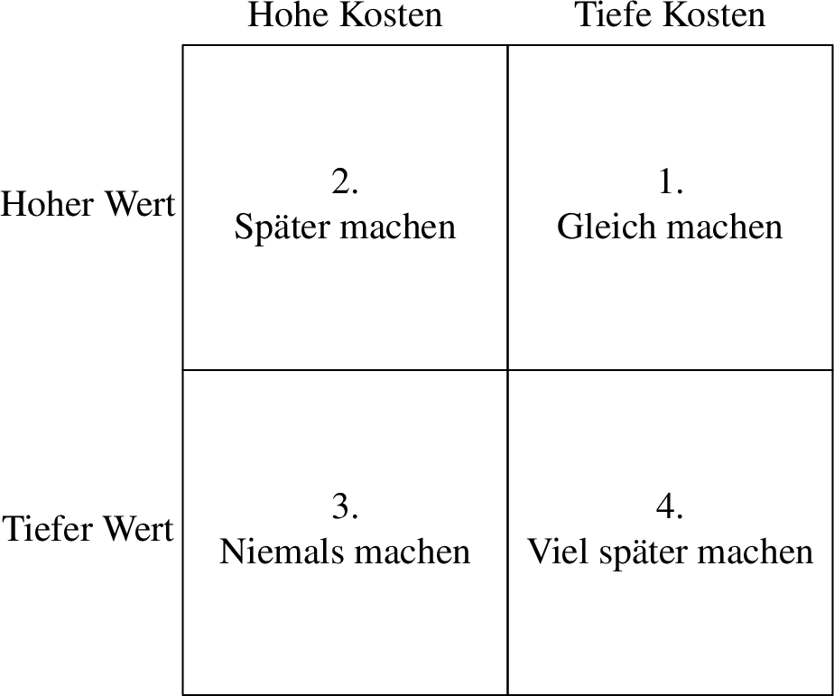
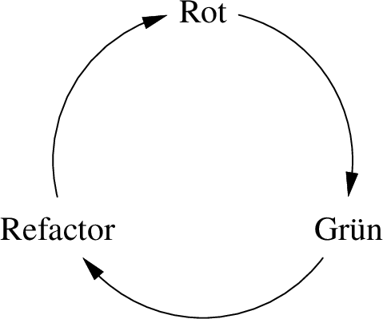

**Hinweis zur Übersetzung:** Hierbei handelt es sich um die deutschsprachige
Übersetzung einer englischsprachigen Buchzusammenfassung, die über das
englischsprachige Original geschrieben worden ist. Manche Begriffe wurden frei
auf Deutsch übersetzt, andere im englischen Original belassen. Auf eigene
Übersetzungen folgt beim ersten Auftreten jeweils der Originalbegriff in
Klammern.

Im Englischen wurde der Begriff "agile software development" mit "Agile"
abgekürzt. Deshalb steht auch in dieser Übersetzung der substantivierte Begriff
"Agile" geschrieben, der englisch auszusprechen ist, wo "agile
Softwareentwicklung" gemeint ist.

# Einführung in Agile

Das _Manifest für Agile Softwareentwicklung_ (_Agile Manifesto_) ist das
Ergebnis eines Treffens von 17 Experten für Software anfangs 2001 als Reaktion
auf schwergewichtige Prozesse wie Wasserfall (_Waterfall_). Seither erfreute
sich Agile weiter Verbreitung und wurde auf verschiedene Arten erweitert ‒
leider nicht immer im Sinne der ursprünglichen Idee.

## Geschichte von Agile

Die grundlegende Idee von Agile ‒ die Arbeit mit kleinen Zwischenzielen, wobei
der Fortschritt gemessen wird ‒ könnte so alt sein wie unsere Zivilisation. Es
ist auch möglich, dass agile Praktiken in den Anfängen der Softwareentwicklung
verwendet worden sind. Die Idee des wissenschaftlichen Managements (_Scientific
Management_), welche auf dem Taylorismus beruht, von oben herab organisiert ist
und auf eine detaillierte Planung setzt, war zu dieser Zeit in der Industrie
weit verbreitet, wodurch sie in Konflikt zu den vor-agilen (_Pre-Agile_)
Praktiken stand, die zu dieser Zeit vielerorts in der Softwareentwicklung zum
Einsatz kamen.

Wissenschaftliches Management war für Projekte geeignet, bei denen Änderungen
teuer waren und zu denen es eine genau definierte Problemdefinition mit extrem
spezifischen Zielen gab. Vor-agile Praktiken andererseits eigneten sich gut für
Projekte, bei denen Änderungen günstig, das Problem nur teilweise definiert und
die Ziele informell spezifiziert waren.

Leider gab es zu dieser Zeit keine Diskussion darüber, welcher Ansatz für
Softwareprojekte der bessere war. Stattdessen fand das Wasserfallmodell weite
Verbreitung, das ursprünglich von Winston Royce in seinem Fachartikel _Managing
the Development of Large Software Systems_ als Strohmannargument aufgebaut
worden war, um dessen Unzulänglichkeiten zu demonstrieren. Das Wasserfallmodell
mit seinem Fokus auf Analyse, Planung und genaues Einhalten von Plänen war ein
Abkömmling des wissenschaftlichen Managements, nicht von vor-agilen Praktiken.

{width=90%}

Das Wasserfallmodell dominierte die Industrie ab den 1970er-Jahren für fast 30
Jahre. Seine aufeinanderfolgenden Phasen von Analyse, Design und Umsetzung
sahen vielversprechend aus für Entwickler, welche in endlosen "Programmieren und
Korrigieren"-Zyklen (_"Code and Fix" Cycles_) arbeiteten, und dabei nicht einmal
die vor-agile Disziplin aufbrachten.

Was auf dem Papier gut aussah ‒ und zu vielversprechenden Ergebnissen nach der
Analyse- und Design-Phase führte ‒ scheiterte oft kläglich in der
Umsetzungsphase. Diese Probleme wurden jedoch auf eine schlechte Ausführung
geschoben, und der Wasserfall-Ansatz selber wurde nicht kritisiert. Stattdessen
wurde dieser Ansatz so dominant, dass auf neue Entwicklungen in der
Software-Industrie wie strukturierte oder objektorientierte Programmierung bald
die Disziplinen der strukturierten und objektorientierten Analyse und des
strukturierten und objektorientierten Designs folgten ‒ und so perfekt zur
Wasserfall-Denkweise passten.

Einige Befürworter dieser Ideen begannen jedoch das Wasserfallmodell mitte der
1990er-Jahre in Frage zu stellen, wie z.B. Grady Booch mit seiner Methode des
objektorientierten Designs (OOD), die Entwurfsmuster-Bewegung (_Design Pattern
Movement_), und die Autoren des _Scrum_-Papers. Kent Becks Ansätze des _Extreme
Programming_ (XP) und der testgetriebenen Entwicklung (_Test-Driven Development,
TDD_) der späten 1990er-Jahre waren eine klare Abkehr vom Wasserfallmodell hin
zu einem agilen Ansatz. Martin Fowlers Gedanken zum _Refactoring_ mit dessen
Betonung von kontinuierlicher Verbesserung passt sicherlich schlecht zum
Wasserfallmodell.

## Das Manifest für Agile Softwareentwicklung

17 Vertreter verschiedener agiler Ideen ‒ Kent Beck, Robert C. Martin, Ward
Cunningham (XP), Ken Schwaber, Mike Beedle, Jeff Sutherland (Scrum), Andrew
Hunt, David Thomas ("Pragmatic Programmers") und weitere ‒ trafen sich anfangs
2001 in Snowbird, Utah, um ein Manifest zu erarbeiten, das die gemeinsame Essenz
all dieser leichtgewichtigen Ideen erfassen sollte. Nach zwei Tagen konnte ein
breiter Konsens erreichen werden:

> Wir erschließen bessere Wege, Software zu entwickeln, indem wir es selbst tun
> und anderen dabei helfen.  Durch diese Tätigkeit haben wir diese Werte zu
> schätzen gelernt:
>
> - **Individuen und Interaktionen** mehr als Prozesse und Werkzeuge
> - **Funktionierende Software** mehr als umfassende Dokumentation
> - **Zusammenarbeit mit dem Kunden** mehr als Vertragsverhandlung
> - **Reagieren auf Veränderung** mehr als das Befolgen eines Plans
>
> Das heißt, obwohl wir die Werte auf der rechten Seite wichtig finden, schätzen
> wir die Werte auf der linken Seite höher ein.

Das _Manifest für Agile Softwareentwicklung_ wurde nach dem Treffen auf
[agilemanifesto.org](https://agilemanifesto.org/iso/de/manifesto.html)
veröffentlicht, wo es noch immer unterschrieben werden kann. Die [12 Prinzipien
hinter dem Agilen Manifest](https://agilemanifesto.org/iso/de/principles.html)
wurden nach den beiden Wochen, die auf das Treffen folgten, in gemeinsamer
Arbeit verfasst. Dieses Dokument erläutert die vier Werte, die im Manifest
aufgeführt sind, und verleiht ihnen eine Richtung; es legt dar, dass diese Werte
wirkliche Konsequenzen haben.

## Überblick über Agile

Viele Softwareprojekte werden mit einem Ansatz basierend auf Zuversicht und
Motivationstechniken geführt. Das Ergebnis ist, dass solche Projekte chronisch
verspätet sind, obwohl die Entwickler Überstunden leisten.

Alle Projekte sind durch einem Kompromiss eingeschränkt, den man als das
_eiserne Kreuz des Projektmanagements_ (_Iron Cross of Project Management_)
bezeichnet: gut, schnell, günstig, fertig ‒ wähle drei! Gute Projektmanager
verstehen diesen Kompromiss und streben nach Ergebnissen die gut genug sind, in
einem akzeptablen Zeitrahmen und Budget erreicht werden können und die
wesentlichen Features bieten.

Agile produziert Daten, welche Managern dabei helfen, gute Entscheidungen zu
treffen. Die _Velocity_ zeigt die Menge der Punkte auf, die ein Entwicklungsteam
innerhalb einer Iteration abarbeitet. Ein _Burn-Down Chart_ zeigt die
verbleibenden Punkte bis zur Erreichung des nächsten Meilensteins auf. Diese
Punktzahl schrumpft nicht notwendigerweise mit der Geschwindigkeit der Velocity,
weil Anforderungen und deren Schätzung sich ändern können. Trotzdem kann das
Gefälle des Burn-Down Charts dazu verwendet werden, um ein wahrscheinliches
Release-Datum für den nächsten Meilenstein vorherzusagen.

Agile ist ein Ansatz, der auf Rückkoppelung basiert (_Feedback-Driven
Approach_). Auch wenn im Agile-Manifest weder Velocity noch Burn-Down Charts
erwähnt werden, ist das Sammeln solcher Daten und das Treffen von Entscheidungen
auf dieser Grundlage entscheidend. Solche Daten sollen öffentlich,
offensichtlich und transparent gemacht werden.

Das Enddatum eines Projekts ist normalerweise gegeben und kann nicht verhandelt
werden, oft aus guten Gründen des Geschäftsinteresses. Die Anforderungen ändern
sich hingegen häufig, weil Kunden nur ein grobes Ziel haben, aber nicht die
genauen Schritte kennen, um dieses zu erreichen.

## Ein Wasserfall-Projekt

Zu Zeiten des Wasserfallmodells wurde ein Projekt oft in drei Phasen gleicher
Länge aufgeteilt: Analyse, Design und Umsetzung. In der Analysephase wurden
Anforderungen gesammelt und die Planung wurde durchgeführt. In der Designphase
wurde eine Lösung skizziert und die Planung verfeinert. Keine der beiden Phasen
haben harte oder greifbare Ziele; sie galten dann als abgeschlossen, wenn das
Enddatum der Phase erreicht worden war.

Die Umsetzungsphase muss jedoch funktionierende Software hervorbringen ‒ ein
hartes und greifbares Ziel, dessen Erreichung einfach zu beurteilen ist.
Verspätungen sind oft erst in dieser Phase zu erkennen, und Anspruchsgruppen
(_Stakeholders_) erfahren erst von solchen Problemen, wenn das Projekt
eigentlich schon beinahe abgeschlossen sein sollte.

Solche Projekte enden häufig in einem "Todesmarsch" (_Death March_): eine kaum
funktionierende Lösung wird nach vielen Überstunden herausgebracht, obwohl die
Abgabefrist (_Deadline_) mehrmals verschoben worden ist. Die "Lösung" für das
nächste Projekt besteht normalerweise darin, dass noch mehr Analyse und Design
gemacht wird ‒ mehr von dem, was schon vorher nicht funktioniert hat (_Runaway
Process Inflation_).

## Der agile Ansatz

Wie beim Wasserfallmodell beginnt auch ein agiles Projekt mit der Analyse ‒ doch
die Analyse ist nie fertig. Die Zeit wird in Iterationen oder _Sprints_ von
normalerweise zwei Wochen eingeteilt. Die _Iteration null_ (_Iteration Zero_)
wird dazu verwendet, die anfänglichen Stories zu schreiben und zu schätzen,
sowie um die Entwicklungsumgebung aufzusetzen, ein vorläufiges Design zu
entwerfen, und einen groben Plan zu machen. Analyse, Design und Umsetzung finden
in jeder Iteration statt.

Nach Abschluss der ersten Iteration sind normalerweise weniger Stories
abgeschlossen worden als ursprünglich geschätzt. Das ist kein Misserfolg,
sondern bietet eine erste Messung, die zur Anpassung des ursprünglichen Plans
verwendet werden kann. Nach ein paar Iterationen kann eine realistische
Durchschnittsvelocity berechnet und eine Schätzung des Releasedatums abgegeben
werden. Das mag oft enttäuschend ausfallen, ist aber wenigstens realistisch.
Hoffnung wird schon früh durch echte Daten ersetzt.

Das Projektmanagement, dass sich mit dem eisernen Kreuz befassen muss ‒ gut,
schnell, günstig, fertig: wähle drei! ‒ kann nun die folgenden Anpassungen
vornehmen:

- _Planung_ (_Schedule_): Das Abschlussdatum ist gewöhnlich nicht verhandelbar,
  und wenn es das ist, entstehen der Firma bei Verspätungen normalerweise
  signifikante Kosten.
- _Personal_ (_Staff_): _"Durch das Hinzufügen von Arbeitskräften zu einem
  verspäteten Projekt verspätet sich das Projekt nur noch mehr._ (Brookes
  Gesetz, _"Adding manpower to a late project makes it later."_) Wenn einem
  Projekt mehr Personal zugewiesen wird, fällt die Produktivität zunächst stark
  ab, und verbessert sich erst nach längerer Zeit. Personal kann langfristig
  aufgestockt werden, sofern man es sich finanziell leisten kann.
- _Qualität_ (_Quality_): Die Qualität zu senken mag zwar kurzfristig den
  Eindruck vermitteln, dass man schneller vorwärts kommt. Langfristig wird aber
  dadurch das Projekt verzögert, weil mehr Fehler eingebaut werden. _"Die
  einzige Möglichkeit schnell voranzukommen, ist gut voranzukommen."_ (_"The
  only way to go fast, is to go well."_)
- _Umfang_ (_Scope_): Wenn es keine andere Möglichkeit gibt, können die
  Anspruchsgruppen oft davon überzeugt werden, ihre Anforderungen auf Features
  einzuschränken, die unbedingt notwendig sind.

{width=1202px}

Die Reduktion des Umfangs ist oftmals die einzige vernünftige Wahl. Darum soll
man zu Beginn eines jeden Sprints sicherstellen, dass dabei nur Features
umgesetzt werden, die für Anspruchsgruppen wirklich wichtig sind.  Andernfalls
läuft man Gefahr, wertvolle Zeit in optionale Features (_"Nice to Have
Features"_) zu investieren.

## Der Kreis des Lebens

Extreme Programming (XP), wie es in Kent Becks _Extreme Programming Explained_
beschrieben ist, erfasst die Essenz der agilen Softwareentwicklung. Die
Praktiken von XP sind im _Kreis des Lebens_ (_Circle of Life_) organisert,
welcher aus drei Ringen besteht. (Die übersetzten Begriffe werden hier nur
ergänzend angegeben. Im weiteren Text werden zumeist die Originalbegriffe
verwendet, da diese im deutschsprachigen Raum geläufig sind, zumindest in der
Softwareentwicklung.)

{width=90%}

Der äussere Ring umfasst die geschäftsorientierten (_business-facing_)
Praktiken, welche ziemlich ähnlich sind wie der Scrum-Prozess:

- **Planning Game** (Planungsspiel): das Projekt in Features, Stories und
  Aufgaben herunterbrechen
- **Small Releases** (kleine Releases): kleine, aber regelmässige Inkremente
  ausliefern
- **Acceptance Tests** (Akzeptanztests): unmissverständliche Abschlusskriterien
  angeben (_Definition of "Done"_)
- **Whole Team** (Team als Ganzes): in verschiedenen Funktionen (Programmierer,
  Tester, Management) zusammenarbeiten

Der mittlere Ring umfasst die teamorientierten (_team-facing_) Praktiken:

- **Sustainable Pace** (nachhaltiges Tempo): Fortschritt machen und dabei das
  Ausbrennen (_Burnout_) des Entwicklugsteams verhindern
- **Collective Ownership** (gemeinsamer Besitz): Wissen über das Projekt
  austauschen, um Wissenssilos zu vermeiden
- **Continuous Integration** (kontinuierliche Integration): häufiges Schliessen
  des _Feedback Loops_ und den Fokus des Teams aufrechterhalten
- **Metaphor** (Metapher): mit einem gemeinsamen Wortschatz und mit einer gemeinsamen
  Sprache arbeiten

Der innere Ring umfasst die technischen (_technical_) Praktiken:

- **Pair Programming**/**Pairing** (paarweises Programmieren): Wissen
  austauschen, Reviews durchführen, zusammenarbeiten
- **Simple Design** (einfaches Design): unnötige Aufwände vermeiden
- **Refactoring** (Überarbeitung): alle Arbeitserzeugnisse kontinuierlich
  verbessern
- **Test-Driven Development** (testgetriebene Entwicklung): die Qualität beim
  schnellen Fortschreiten hoch halten

Diese Praktiken haben eine gute Übereinstimmung zu den agilen Werten aus dem
Manifest:

- **Individuen und Interaktionen** mehr als Prozesse und Werkzeuge
    - Whole Team (geschäftsorientiert)
    - Metaphor (teamorientiert)
    - Collective Ownership (teamorientiert)
    - Pair Programming/Pairing (technisch)
- **Funktionierende Software** mehr als umfassende Dokumentation
    - Acceptance Tests (geschäftsorientiert)
    - Test-Driven Development (technisch)
    - Simple Design (technisch)
    - Refactoring (technisch)
    - Continuous Integration (technisch)
- **Zusammenarbeit mit dem Kunden** mehr als Vertragsverhandlung
    - Planning Game (geschäftsorientiert)
    - Small Releases (geschäftsorientiert)
    - Acceptance Tests (geschäftsorientiert)
    - Metaphor (teamorientiert)
- **Reagieren auf Veränderung** mehr als das Befolgen eines Plans
    - Planning Game (geschäftsorientiert)
    - Small Releases (geschäftsorientiert)
    - Acceptance Tests (geschäftsorientiert)
    - Sustainable Pace (teamorientiert)
    - Refactoring (technisch)
    - Test-Driven Development (technisch)

Zusammenfassend:

> Agile ist eine kleine Disziplin, welche kleinen Software-Teams beim Handhaben
> kleiner Projekte hilft. Grosse Projekte werden aus kleinen Projekten gemacht.

# Gründe für Agile

Viele Entwickler, die aufgrund des Versprechens von Geschwindigkeit und Qualität
auf Agile umsteigen, sind enttäuscht, wenn sich diese Ergebnisse nicht sofort
einstellen. Die wichtigeren Gründe, um auf Agile umzusteigen, sind jedoch
_Professionalität_ und _angemessene Erwartungen des Kunden_.

## Professionalität

In Agile wird eine hohe Hingabe zur Disziplin stärker gewichtet als Zeremonien.
Diszipliniertes, professionelles Verhalten wird immer wichtiger, da auch
Software selbst immer wichtiger wird. Computer sind ‒ und darum ist auch
Software ‒ heutzutage praktisch allgegenwärtig. Nur noch wenig kann ohne
Software überhaupt erreicht werden.

Software wird von Programmierern entwickelt ‒ und schlechte Software kann Leute
umbringen. Darum werden Programmierer beschuldigt, wenn Leute aufgrund
fehlerhafter Software um ihr Leben kommen. Die Disziplinen der agilen
Softwareentwicklung sind ein erster Schritt in Richtung Professionalität ‒
wodurch längerfristig das Leben von Menschen gerettet werden könnte.

## Angemessene Erwartungen des Kunden

Manager, Kunden und Benutzer haben angemessene Erwartungen an Software und an
deren Entwickler. Das Ziel der agilen Softwareentwicklung ist es, diese
Erwartungen zu erfüllen, was keine einfache Aufgabe ist:

- **Keine schlechte Software ausliefern:** Ein System soll einem Benutzer nicht
  abverlangen, wie ein Programmierer zu denken. Leute zahlen gutes Geld für
  Software ‒ und sollten im Gegenzug hohe Qualität mit nur wenigen Defekten
  erhalten.
- **Ständige technische Bereitschaft:** Programmierer können häufig nicht
  pünktlich nützliche Software ausliefern, weil sie an zu vielen Features
  gleichzeitig arbeiten, statt sich zunächst auf die wichtigsten Features zu
  konzentrieren. Agile verlangt, dass ein System am Ende einer jeden Iteration
  technisch auslieferbar (_deployable_) ist. Der Code ist sauber, und alle Tests
  laufen durch. Ob die Software ausgeliefert werden soll oder nicht ‒ das ist
  keine technische, sondern eine geschäftliche Entscheidung.
- **Beständige Produktivität:** Oftmals macht man zu Beginn eines Projekts
  schnell Fortschritt, doch dieser verlangsamt sich, da sich chaotischer Code
  ansammelt. Dem Projekt weiteres Personal zuzuweisen hilft nur langfristig ‒
  aber überhaut nichts, wenn diese neuen Programmierer von denjenigen
  Programmierern instruiert werden, welche das Chaos ursprünglich angerichtet
  haben. Mit dem Fortschreiten dieser Negativspirale gerät der Fortschritt ins
  Stocken. Die Entwickler wollen nun noch einmal von vorne anfangen. Eine neue
  Codebasis wird erstellt ‒ welche nur die alte, chaotische Codebasis als
  zuverlässige Quelle für Anforderungen hat. Das alte System wird von der einen
  Hälfte des Teams gewartet und weiterentwickelt, und die andere Hälfte hinkt
  mit der Arbeit am neuen System hinterher; sie versuchen, ein sich bewegendes
  Ziel zu treffen. Grosse Neuentwicklungen scheitern oft, nur wenige werden je
  zu den Kunden ausgeliefert.
- **Günstige Anpassung:** Software ("soft", "weich") soll im Gegensatz zu
  Hardware ("hard", "hart") einfach zu verändern sein. Ändernde Anforderugen
  werden von vielen Entwicklern als Ärgernis empfunden, sind aber der Grund,
  warum die Disziplin _Software Engineering_ überhaupt existiert. (Änderte sich
  nichts, könnte man gleich Hardware entwickeln.) Ein gutes Software-System soll
  einfach zu ändern sein.
- **Beständige Verbesserung:** Software soll mit der Zeit besser werden. Design,
  Architektur, Code-Struktur, Effizienz und Durchsatz eines Systems sollen sich
  verbessern und nicht mit der Zeit schlechter werden.
- **Furchtlose Kompetenz:** Entwickler schrecken oft davor zurück, schlechten
  Code anzupassen, und darum wird schlechter Code nicht verbessert. ("Fasst du
  es an, machst du es kaputt. Machst du es kaputt, ist es deins.") Die
  Testgetriebene Entwicklung ist hilfreich dabei, diese Furcht zu bewältigen, da
  sie eine automatisierte Qualitätsbewertung nach jeder Änderung des Codes
  per Knopfdruck ermöglicht.
- **Keine QA-Befunde:** Fehler sollten nicht von der QA-Abteilung (_Quality
  Assurance_, Qualitätssicherung) gefunden, sondern im Voraus vom
  Entwicklungsteam verhindert oder eliminiert werden. Wenn das QA Fehler findet,
  muss das Entwicklungsteam diese nicht nur korrigieren, sondern auch den
  eigenen Arbeitsprozess verbessern.
- **Testautomatisierung:** Manuelle Tests sind teuer und werden deshalb
  reduziert oder gleich ausgelassen, wenn das Projektbudget gekürzt wird. Wenn
  die Entwicklung spät dran ist, hat die Qualitätssicherung zu wenig Zeit zum
  Testen. Teile des Systems bleiben so ungetestet. Maschinen sind besser als
  Menschen darin, repetitive Aufgaben wie das Testen durchzuführen (exploratives
  Testen ausgenommen). Es ist eine Verschwendung von Zeit und Geld, wenn man
  Menschen manuelle Tests durchführen lässt; es ist ausserdem unmoralisch.
- **Für einander einstehen:** Entwickler müssen einander helfen; sie müssen wie
  ein Team handeln. Wenn jemand einen Fehler begeht oder krank wird, sollen die
  andere Teammitglieder aushelfen. Die Entwickler müssen sicherstellen, dass die
  anderen für sie einspringen können, indem sie Code dokumentieren, Wissen
  teilen, und anderen im Gegenzug ebenfalls helfen.
- **Aufrichtige Schätzungen:** Entwickler müssen auf Basis ihres Wissensstands
  aufrichtige Aufwandsschätzungen abgeben. Bei Ungewissheit sollen Bandbreiten
  ("5 bis 15 Tage") anstelle von genauen Schätzungen ("10 Tage") abgegeben
  werden. Aufgaben können nicht immer genau geschätzt werden, jedoch in
  Beziehung zu anderen Aufgaben ("dies braucht doppelt so lange wie das").
- **"Nein" sagen:** Kann für ein Problem keine praktikable Lösung gefunden
  werden, müssen Entwickler das zur Aussprache bringen. Das kann zwar unbequem
  sein, dafür jedoch grössere Probleme im weiteren Projektverlauf vermeiden.
- **Beständiges Lernen:** Entwickler müssen mit einer sich beständig und schnell
  verändernden Industrie schritthalten, indem sie ständig lernen. Es ist
  lobenswert, wenn eine Firma Weiterbildungen anbietet, doch die Verantwortung
  für das Lernen bleibt beim Entwickler.
- **Mentoring:** Bestehende Teammitglieder können neue Teammitglieder anlernen.
  Bei diesem Vorgang lernen beide Seiten etwas, denn jemandem etwas beizubringen
  ist eine gute Methode, um selber etwas zu lernen.

## Die Freiheitsurkunde ("Bill of Rights")

Agile soll die Spaltung zwischen dem Geschäft (_Business_) und der Entwicklung
überwinden. Beide Seiten ‒ Kunden und Entwickler ‒ haben sich ergänzende Rechte.

Kunden haben das Recht…

- … auf einen Gesamtplan: was kann wann zu welchen Kosten erreicht werden?
- … das Beste aus jeder Iteration zu bekommen.
- … Fortschritt im Sinne von durchlaufenden, eigens definierter Tests zu sehen.
- … auf Sinneswandel und Änderung der Prioritäten.
- … bei Änderungen am Zeitplan oder an Schätzungen informiert zu werden.
- … das Projekt jederzeit abzubrechen und doch ein funktionierendes System zu
  erhalten.

Entwickler haben das Recht…

- … zu wissen, was verlangt wird, und was die Prioritäten sind.
- … qualitativ hochwertige Arbeit abzuliefern.
- … um Hilfe zu fragen und diese zu erhalten.
- … ihre Schätzungen anzupassen.
- … Verantwortung selber zu akzeptieren, statt diese übertragen zu bekommen.

Agile ist nicht ein Prozess, sondern eine Menge von Rechten, Erwartungen und
Disziplinen, welche die Basis für eine ethische Berufung bilden.

# Geschäftsorientierte Praktiken

Die Entwicklung muss den folgenden geschäftsorientierten Praktiken folgen, um
erfolgreich zu sein zu können: _Planning Game_ (Planugsspiel), _Small Releases_
(kleine Releases), _Acceptance Tests_ (Akzeptanztests) und _Whole Team_ (Team
als Ganzes).

## Planung

Ein Projekt kann geplant werden, indem es rekursiv in seine Einzelteile zerlegt
wird, und diese dann geschätzt werden. Je weiter diese Teile heruntergebrochen
werden ‒ im Extremfall bis zu einzelnen Codezeilen herunter ‒ desto zutreffender
und genauer wird die Schätzung, aber desto mehr Zeit wird benötigt, um überhaupt
eine Schätzung abgeben zu können. Eine Schätzung sollte so zutreffend wie
möglich, aber nur so genau wie nötig sein.

Indem eine Zeitspanne (z.B. 5-15 Tage) anstelle einer genauen Zeitdauer (z.B. 10
Tage) angegeben wird, kann eine Schätzung ungenau, aber immer noch zutreffend
sein. Eine _trivariate Schätzung_ (_Trivariate Estimation_) gibt für eine
Aufgabe einen Idealfall, einen Normalfall, und einen ungünstigsten Fall an,
sodass diese mit einer Wahrscheinlichkeit von 5%, 50% oder 95% innerhalb der
geschätzen Zeit umgesetzt wird.

Wird beispielsweise für eine Aufgabe geschätzt, dass sie 8 Tage (Idealfall), 12
Tage (Normalfall) und 16 Tage (ungünstigster Fall) benötigt, hat sie eine Chance
von 5% in von 8 Tagen, von 50% in 12 Tagen und von 95% in 16 Tagen abgeschlossen
zu werden. Anders ausgedrückt: Von 100 vergleichbaren Aufgaben werden 5
innerhalb vom Idealfall, 50 innerhalb vom Normalfall und 95 innerhalb vom
ungünstigsten Fall abgeschlossen.

### User Stories und Story Points

Diese Technik funktioniert gut für die langfristige Planung, ist aber zu ungenau
für die tägliche Planung innerhalb eines Projekts. Zu diesem Zweck wird eine
Technik verwendet, die auf einer iterativ kalibrierendem Rückkopplungsschleife
(_Iteratively Calibrating Feedback Loop_) basiert: _Story Points_.

Eine _User Story_ wird aus der Perspektive des Benutzers geschrieben und
beschreibt ein Feature des Systems, das zu entwickeln ist, beispielsweise: "Als
Benutzer möchte ich gefragt werden, ob ich mein Dokument speichern möchte, wenn
ich die Applikation schliesse ohne vorher gespeichert zu haben." Die Details
werden zu Beginn weggelassen und erst geklärt, wenn die Entwickler die Story für
die Umsetzung aufnehmen.

Moderner Technologie zum Trotz erlaubt das Aufschreiben dieser Stories auf
Karteikarten den physischen Umgang mit den Stories in Besprechungen, was sehr
hilfreich sein kann. Karteikarten verlangen eine gewisse Disziplin, die Stories
ungenau zu belassen, damit der Planungsvorgang nicht in lauter Details
steckenbleibt. Diese Karten sollen nicht zu wertvoll werden, um bei Bedarf nicht
entsorgt zu werden zu können.

Die Story-Karten, die in Iteration null geschrieben worden sind, werden in einer
informellen Besprechung geschätzt, die anschliessend regelmässig stattfindet; in
der Regel zu Beginn jedes Sprints. Das Schreiben und Schätzen der Stories ist
ein andauernder Vorgang. Die Schätzung beginnt damit, dass eine Story von
durchschnittlicher Grösse gewählt wird, welcher eine durchschnittliche Anzahl
von Story Points zugewiesen wird, z.B. 3 Story Points, wenn man mit einer
Bandbreite von 1-5 Story Points arbeitet.

Die Grösse der anderen Stories wird im Vergleich zu dieser _goldenen Story_
geschätzt und erhält die entsprechende Punktzahl zugewiesen. Diese Anzahl der
Story Points wird auf die Karteikarte der Story geschrieben. Diese Punkte lassen
sich _nicht_ in Zeiteinheiten umrechnen! Verschiedene Entwickler benötigen 
unterschiedlich lange, um die gleiche Story umzusetzen. Glücklicherweise gleichen
sich diese Unterschiede dank dem _Gesetz der grossen Zahl_ (_Law of Large
Numbers_) aus, wenn viele Stories über mehrere Sprints hinweg umgesetzt werden.

### Iterationsplanung

Eine Iteration beginnt mit der Iterationsplanungssitzung (_Iteration Planning
Meeting_, _IPM_), welche höchstens einen Zwanzigstel der gesamten Iterationszeit
einnehmen sollte, d.h. höchstens einen halben Tag für eine zweiwöchige
Iteration. Das ganze Team ‒ Anspruchsgruppen, Programmierer, Tester, Business
Analysten, Projektmanager ‒ nimmt an dieser Besprechung teil.

Die Programmierer schätzen ihre Velocity für die anstehende Iteration, d.h. wie
viele Story Points sie glauben umsetzen zu können. Hierbei handelt es sich um
eine grobe Schätzung, welche für die erste Iteration viel zu hoch gegriffen ist.
Die Anspruchsgruppen wählen die Stories, welche sich innerhalb der von den
Programmierern geschätzten Velocity unterbringen lassen. Diese Schätzung ist
_keine_ Verpflichtung!

Die Anspruchsgruppen spielen das Vier-Quadranten-Spiel (_Four-Quadrant Game_) um
die richtigen Stories auszuwählen, d.h. diejenigen mit der höchsten "Rendite"
(_Return on Invest_, _ROI_). Entlang der beiden Achsen von Kosten und Wert kann
jede Story in einen von vier Quadranten untergebracht werden:

{width=924px}

1. Wertvoll, aber günstig: diese Stories sollten gleich umgesetzt werden.
2. Wertvoll, aber teuer: diese Stories sollten erst später umgesetzt werden.
3. Nicht wertvoll, aber teuer: diese Stories sollten gleich verworfen werden.
4. Nicht wertvoll, aber günstig: diese Stories sollten, wenn überhaupt, erst
   viel später umgesetzt werden.

In der Mitte der ersten Iteration sollte die Hälfte der Story Points erledigt
sein. Sollten weniger erledigt sein, was in der ersten Iteration zu erwarten
ist, ist die Iteration _nicht_ gescheitert, denn sie erzeugt wertvolle Daten.
Die erste Hälfte der Iteration ist, was die Velocity betrifft, eine gute
Vorhersage für die zweite Hälfte; sowie das heutige Wetter die beste Vorhersage
für das morgige Wetter ist. Ebenso ist die Velocity der aktuellen Iteration eine
gute Vorhersage für die Velocity der darauffolgenden Iteration.

Das Projekt ist beendet, wenn nicht mehr genug Stories, die es ihrer "Rendite"
gemäss lohnen würde, sie umzusetzen, für eine weitere Iteration zusammengebracht
werden können.

### INVEST-Stories

User Stories sind keine detaillierte Beschreibung von Features, sondern eher
eine Erinnerung an Features. Die Abkürzung INVEST steht für einfache
Richtlinien, die man beim Schreiben von Stories befolgen kann:

- **I**: _Independent_ (unabhängig). User Stories müssen nicht in einer
  bestimmten Reihenfolge umgesetzt werden, weil sie voneinander unabhängig sind.
  Obwohl Abhängigkeiten manchmal nicht vermieden werden können, sollten sie doch
  auf ein Minimum reduziert werden, damit Stories in der Reihenfolge ihres
  wirtschaftlichen Nutzens (_Business Value_) umgesetzt werden können.
- **N**: _Negotiable_ (verhandelbar). User Stories sollen Raum für Verhandlungen
  zwischen dem Geschäft (_Business_) und der Entwicklung bieten. Mit diesen
  Verhandlungen können die Kosten tief gehalten werden, indem man sich auf
  einfache Features und eine einfache Implementierung einigt.
- **V**: _Valuable_ (wertvoll). User Stories müssen einen klaren und messbaren
  wirtschaftlichen Nutzen (_Business Value_) schaffen. "Weiche" Angaben wie
  hoch/mittel/tief sind in Ordnung, so lange die Stories im Bezug auf ihren
  wirtschaftlichen Nutzen miteinander verglichen werden können. Solche Stories
  betreffen normalerweise alle Schichten: vom Frontend über das Backend zur
  Datenbank und Middleware. Architektur, Refactoring und Aufräumarbeiten sind
  keine User Stories!
- **E**: _Estimable_ (schätzbar). User Stories müssen konkret genug sein, damit
  sie von den Entwicklern geschätzt werden können. Stories müssen jedoch auch
  verhandelbar sein, weshalb man die goldene Mitte Zwischen Spezifizität und
  Unschärfe anstreben soll, indem man präzise über den wirtschaftlichen Nutzen
  ist, Details über die Umsetzung jedoch auslässt.
- **S**: _Small_ (klein). User Stories sollen maximal so gross sein, dass sie
  von einem oder zwei Entwicklern innerhalb eines Sprints umgesetzt werden
  können. Eine gute Faustregel ist es ungefähr so viele User Stories für eine
  Iteration zu wählen, wie es Entwickler in einem Team hat.
- **T**: _Testable_ (testbar). User Stories sollten jeweils mit Tests
  einhergehen, welche von der Geschäftsseite (_by Business_) definiert werden.
  Eine Story ist dann abgeschlossen, wenn all ihre Tests durchlaufen. Diese
  Tests werden normalerweise von der Qualitätssicherung (_QA_) geschrieben und
  von den Entwicklern automatisiert. Die Spezifizierung der Tests kann später
  erfolgen, als die eigentliche Story geschrieben wird.

### Story-Schätzung

Es gibt verschiedene Möglichkeiten um User Stories zu schätzen. _Fliegende
Finger_ (_Flying Fingers_) ist die einfachste: Nach dem Lesen und Diskutieren
einer Story halten die Entwickler die Anzahl von Fingern noch, die ihrer
Schätzung von Story Points entspricht. Das machen sie hinter ihrem Rücken, und
auf drei werden alle Hände gezeigt.

_Planungspoker_ (_Planning Poker_) ist ein ähnlicher Ansatz, der auf
nummerierten Karten basiert, welche die Menge an Story Points bezeichnen.
Gewisse Kartensätze verwenden eine Fibonacci-Reihe (1, 2, 3, 5, 8), manchmal mit
weiteren Bezeichnungen: unendlich (∞) für Stories, die zum Schätzen zu gross
sind, ein Fragezeichen (?), falls nicht genügend Informationen vorhanden sind,
um eine Story schätzen zu können, und null (0), falls die Story zu trivial zum
Schätzen ist.

Wenn die Finger oder Karten gezeigt werden, kann es einen Konsens geben. In
diesem Fall wird die gemeinsame Zahl auf die Karteikarte geschrieben. Wenn es
grosse Abweichungen gibt, sollen diese diskutiert werden, gefolgt von einer
weiteren Schätzrunde, bis ein Konsens erreicht werden kann.

Stories, welche zu trivial für eine Schätzung sind (0), können miteinander
kombiniert werden, indem man ihre Karteikarten aneinanderheftet. Mehrere Nullen
können tatsächlich zu etwas aufsummiert werden, das grösser als null ist.
Stories, die zu gross sind (∞), können aufgeteilt werden, solange man dabei die
INVEST-Richtlinien einhält.

Stories, die zu unklar für eine Schätzung sind (?), erfordern oftmals weitere
Abklärungen. Eine _Meta-Story_ ‒ ein sogenannter _Spike_ ("Spitze"), der eine
ganz dünne Scheibe durch das ganze System schneidet ‒ wird erstellt und als
Abhängigkeit der ursprünglichen, unklaren Story referenziert.

### Iteration und Release

Eine Iteration produziert Daten, indem Stories umgesetzt werden. Der Fokus
sollte darauf liegen, Stories komplett abzuschliessen, statt möglichst viele
Aufgaben innerhalb verschiedener Stories: lieber 80% der Stories komplett
umgesetzt, als 80% der Aufgaben aller Stories abgeschlossen zu haben. Stories
werden nicht den Programmierern zugewiesen, sondern individuell ausgewählt,
indem man innerhalb des Entwicklungsteam verhandelt. Erfahrene Programmierer
sollten Neulinge davon abbringen, zu viele oder zu umfangreiche Stories
auszuwählen.

Die Qualitätssicherung (_QA_) sollte gleich nach dem IPM damit beginnen die
Akzeptanztests zu schreiben, damit sie bis zur Hälfte der Iteration
abgeschlossen sind. Die Entwickler können diesen Prozess unterstützen, doch es
sollte nie der gleiche Entwickler sein, der für die Umsetzung der Story und das
Schreiben deren Akzeptanztests verantwortlich ist. QA und Entwickler sollten
jedoch immer eng an den Akzeptanztests zusammenarbeiten. Eine Story ist fertig,
wenn all ihre Akzeptanztests erfolgreich durchlaufen.

Am Ende einer jeden Iteration wird den Anspruchsgruppen eine Demonstration
gegeben. Die neu entwickelten Features und durchlaufenden (alte wie neue)
Akzeptanztests werden gezeigt. Nach der Demo werden die Velocity und das
Burn-Down Chart aktualisiert. Die Velocity mag zu Beginn stark fluktuieren,
dürfte sich nach einigen Iterationen jedoch auf einen Wert einpendeln.

Eine steigende Velocity kann ein Hinweis auf Inflation der Story Points (_Story
Point Inflation_) sein: mit zunehmendem Druck, der auf das Enticklungsteam
ausgeübt wird, um mehr zu erreichen, fangen die Entwickler an, den Stories mehr
Punkte zuzuweisen. Die Velocity ist eine Messgrösse und kein Ziel: man soll
niemals Druck auf etwas ausüben, was gemessen werden soll!

Eine sinkende Velocity ist wahrscheinlich ein Hinweis auf schlechte
Codequalität, welche die Weiterentwicklung herunterzieht. Werden zu wenige
Unittests geschrieben, werden die Entwickler zögerlich beim Refactoring. Steigt
der Druck, werden Entwickler dazu verleitet die Story Points hochzutreiben
(Inflation). Hier sollte man an die _goldene Story_ von ganz zu Beginn denken,
um der Inflation gegenzusteuern.

Die Software soll so oft wie möglich freigegeben werden. Das Ziel des
beständigen Auslieferns (_Continuous Delivery_) ist es, einen produktiven
Release nach jeder Änderung zu machen. Früher waren diese Zyklen lang, da auch
die Umschlagszeiten (Testen, Code auschecken) lang waren. Mit moderner
Versionskontrolle, die optimistische Locks verwenden, tendiert die Checkout-Zeit
gegen null, und beständiges Ausliefern wird möglich. Alte Organisationen müssen
ihren Prozess entsprechend anpassen, um ihre Trägheit zu überwinden, was einen
kulturellen Wandel erfordert.

## Akzeptanztests

Akzeptanztests (_Acceptance Tests_) basieren auf der Idee, dass Anforderungen
vom Geschäft (_by the Business_) spezifiziert werden sollten. Das Wort
"spezifizieren" (_to specify_) hat verschiedene Bedeutungen, je nach dem, wer es
verwendet: auf geschäftlicher Seite will man die Spezifikation eher etwas
schwammig in natürlicher Sprache halten, wogegen Programmierer eine
Spezifikation bevorzugen, die so präzise ist, dass sie von einer Maschine
überprüft werden kann.

Die Lösung für diesen Konflikt ist, dass man auf geschäftlicher Seite einen Test
in natürlicher Sprache definiert, aber eine formale Struktur wie _Gegeben, Wenn,
Dann_ (_Given, When, Then_, wie sie im _Behaviour-Driven Development_, BDD, zum
Einsatz kommt). Die Entwickler setzen diese Tests dann in ihrer
Programmiersprache um. Diese werden zur _Definition of Done_ der User Story.

- Eine Story ist nicht spezifiziert, bis Akzeptanztests dafür geschrieben sind.
- Eine Story ist nicht abgeschlossen, bis ihre Akzeptanztests durchlaufen.

Auf Geschäftsseite definiert man normalerweise den "günstigen Ablauf" (_Happy
Path_), welcher demonstriert, dass das System den vorgesehenen Mehrwert
erzeugt. Die Qualitätssicherung erweitert diese Tests um die "ungünstigen
Abläufe" (_Ynhappy Path_), weil sie gut darin ist, Ausnahmefälle zu finden, und
Möglichkeiten zu entdecken, wie ein Benutzer das System "kaputt" machen kann.

Die Qualitätssicherung ist nicht mehr der Flaschenhals am Ende einer Iteration,
sondern von Anfang an stark involviert. Viele Bugs am Ende einer Iteration zu
finden wird nicht mehr als Nachweis dafür gesehen, dass die Qualitätssicherung
ihre Arbeit gut erledigt. Stattdessen liefert die Qualitätssicherung der
Entwicklung die Testspezifikationen, und die Entwicklung stellt sicher, dass
diese Tests durchlaufen. Der Vorgang der Ausführung dieser Tests soll
selbstverständlich automatisiert werden.

## Team als Ganzes

Die Praktik _Whole Team_ wurde früher als _Kunde vor Ort_ (_On-Site Customer_)
bezeichnet. Sie basiert auf der Idee, dass eine Reduktion der physischen Distanz
die Kommunikation verbessert. "Kunde" (_Customer_) ist in einem sehr weiten Sinn
gemeint: es kann eine Anspruchsgruppe eines Projekts, oder bei Scrum den
_Product Owner_ bezeichnen.

Hat man das gesamte Projektteam im gleichen Raum sitzen, wird nicht nur die
Kommunikation effizienter, es erzeugt auch glückliche Zufälle (_Serendipity_):
Leute in verschiedenen Rollen werden aus reinem Zufall zusammenkommen (z.B. an
der Kaffeemaschine). Es ist zu hoffen, dass solche ungeplanten Interaktionen
Synergien im Team hervorbringen.

Die Vorteile einer gemeinsamen Unterbringung ‒ bessere Kommunikation, glückliche
Zufälle ‒ gehen in einer Outsourcing-Umgebung verloren. Mit wachsender Distanz ‒
physisch, kulturell, sprachlich, verschiedene Zeitzonen ‒ wird die Kommunikation
tendenziell schlechter. Da die Technologie jedoch Fortschritte gemacht hat, geht
das Arbeiten von einem entfernten Ort aus heutzutage recht gut, gerade wenn es
nur eine räumliche, aber keine kulturelle oder sprachliche Distanz gibt, und man
sich in der gleichen Zeitzone befindet. Zufällige Gespräche und non-verbale
Kommunikation sind bei der Telearbeit jedoch erheblich reduziert.

# Teamorientierte Praktiken

In den agilen Team-Praktiken  geht es um die Beziehungen zwischen den einzelnen
Teammitgliedern zueinander und zu dem Produkt, das erschaffen wird. Dies sind
Metaphor (Metapher), Sustainable Pace (nachhaltiges Tempo), gemeinsame
Inhaberschaft (Collective Ownership) und beständige Integration (Continuous
Integration).

## Metapher

Eine effektive Kommunikation innerhalb des Teams setzt eine gemeinsame Sprache
voraus, was einen wohldefinierten Wortschatz vom Begriffen und Konzepten
beinhaltet. Metaphern zu gebrauchen, beispielsweise, indem man etwa einen
Prozess in mehreren Schritten mit einem Fliessband vergleicht, kann die
Kommunikation sowohl innerhalb des Teams als auch mit dem Kunden verbessern.
Lächerliche und unpassende Metaphern, andererseits, können peinlich oder sogar
den Anspruchsgruppen gegenüber beleidigend sein.

Der Begriff _allgegenwärtige Sprache_ (_Ubiquitous Language_), der von Eric
Evans in seinem Buch _Domain-Driven Design_ geprägt worden ist, definiert sehr
gut, was ein Team braucht: ein Modell der Problemdomäne, das von einem
Wortschatz beschrieben wird, der allgemein akzeptierten ist, d.h. von
Programmierern, der Qualitätssicherung, Managern, Kunden, Benutzern ‒ von allen,
die mit dem Projekt zu tun haben.

## Nachhaltiges Tempo

Viele Stunden bis tief in die Nacht hinein zu arbeiten kann Programmierer stolz
machen. Schliesslich sind sie wertvoll und werden gebraucht, und manchmal wird
ein Projekt sogar dadurch gerettet, dass Überstunden geleistet werden. Leider
kann diese gutgemeinte Hingabe ins Burnout führen, was negative Langzeitfolgen
sowohl für den Programmierer als auch den Arbeitgeber zur Folge haben kann.

Die Urteilsfähigkeit ist oft eingeschränkt, wenn man nach einem ganzen
Arbeitstag noch tief bis in die Nacht hinein arbeitet. Oftmals werden zu dieser
Zeit schwere Fehler begannen und schlechte Entscheidungen getroffen.

Ein Softwareprojekt ist eher ein Marathon als ein Sprint oder eine Reihe von
Sprints, und muss darum mit einem nachhaltigen Tempo angegangen werden. Wenn
kurz vor dem Erreichen der Ziellinie noch Energie vorrätig ist, ist es in
Ordnung auf dem letzten Abschnitt zu rennen.

Die Entwickler dürfen sich nicht fügen, wenn sie vom Management dazu angehalten
werden schneller forwärts zu machen. Viele Überstunden zu leisten ist keine
Demonstration von Hingabe des Entwicklers, sondern die Konsequenz einer
schlechten Planung, und häufig die Folge daraus, dass sich manipulierbare
Entwickler zu unrealistischen Abgabefristen nötigen lassen.

Programmierer sollen herausfinden, wie viele Stunden Schlaf sie benötigen, und
Wert darauf legen, dass sie diese Menge an Schlaf durchwegs bekommen.

## Gemeinsame Inhaberschaft

In einem agilen Projekt gehört der Code nicht Einzelnen, sondern dem Team als
ganzes. Obwohl Spezialisierung erlaubt ist und mit wachsender Systemgrösse gar
zwingend wird, muss die Fähigkeitaufrecht erhalten werden, ausserhalb seines
eigenen Spezialgebiets zu arbeiten.

Die Notwendigkeit von Generalisierung in einem System wächst mit dessen
Codebasis. Generalisieren können aber nur Entwickler, die das grosse Ganze (_Big
Picture_) sehen. Mit gemeinsamer Inhaberschaft wird das Wissen über das Team
verteilt, welches dann seine Fähigkeiten im Kommunizieren und Treffen von
Entscheidungen verbessert.

Teams, welche individuellen Codebesitz mit hohen Hürden für das Modifizieren oder
sogar Lesen des Codes von anderen Leuten haben, werden mit der Zeit oft
dysfunktional. Beschuldigungen und Fehlkommunikation grassieren in solchen
Teams. Code, der das gleiche Problem löst, wird mehrmals geschrieben, statt
geteilt zu werden.

## Beständige Integration

Die Praxis der beständigen Integration bestand ursprünglich darin, dass
Quellcode alle paar Stunden eingecheckt und mit dem Hauptentwicklungszweig
zusammengeführt worden ist. Für Änderungen, die bereits technisch ausgeliefert
worden sind, aber noch nicht aktiv sein sollen, werden Schalter für deren
(De)aktivierung (_Feature Toggles_) eingesetzt. Später hat die Einführung von
_Continuous Build_-Werkzeugen, welche alle Tests bei einem Code-Checkin
automatisch ausführen, diesen Zyklus auf Minuten reduziert.

Programmierer sollten alle Tests lokal laufen lassen, bevor sie den Code
einchecken, sodass der Buildvorgang niemals scheitert. Scheitert der
Buildvorgang dennoch, ist es die höchste Priorität für das gesamte Team, dass er
wieder zum Laufen kommt, und dass alle Tests wieder durchlaufen. Wenn die
Disziplin einmal nachlässt und der Buildvorgang in einem kaputten Zustand
belassen wird, wird es sehr unwahrscheinlich, dass sich das Team "später einmal"
darum bemühen wird, das Problem zu lösen. Dies führt dazu, dass früher oder
später ein nicht funktionstüchtiges System ausgeliefert werden wird.

## Standup Meetings

Das _Standup Meeting_ oder _Daily Scrum_ ist optional. Es kann auch weniger
häufig als täglich abgehalten werden; in der Frequenz, die am besten für Team
passt. Die Besprechung sollte ungefähr zehn Minuten dauern, egal wie gross das
Team ist.

Die Teammitglieder stehen in einem Kreis und beantworten die folgenden Fragen:

1. Was habe ich seit dem letzten Meeting gemacht?
2. Was werde ich bis zum nächsten Meeting machen?
3. Was behindert mich dabei?

Es werden keine Diskussionen geführt, keine Erklärungen abgegeben und keine
Beschwerden geäussert. Jeder Entwickler hat eine halbe Minute Zeit. Wenn neben
den Entwicklern noch andere Leute teilnehmen, sollten diese entweder nur zuhören
oder sich gemäss den gleichen Regeln wie die Entwickler äussern.

_Das Huhn und das Schwein_ (_The Chicken and the Pig_) ist eine Fabel, welche
demonstriert, wenn andere Leute als Entwickler ‒ die Hühner, welche ein kleines
Opfer machen, indem sie Eier beitragen ‒ und Entwickler ‒ welche ein grosses
Opfer machen, indem sie Fleisch beitragen ‒ nicht das gleiche Gewicht im
Entscheidungsprozess haben sollten, wenn Entscheidungen über den (Menü-)plan
getroffen werden.

# Technische Praktiken

Die technischen Praktiken von Agile greifen tief in das Verhalten des
Programmierers beim Schreiben von Code ein, indem es eine Reihe von Ritualen
einführt, die von vielen Programmierern als absurd empfunden werden. Diese
Praktiken im Kern von Agile sind: Test-Driven Development, Refactoring, Simple
Design und Pair Programming.

## Test-Driven Development

Programmieren ist der Buchhaltung sehr ähnlich: ein kleiner Fehler kann
gewaltige negative Konsequenzen haben. Darum haben die Buchhalter die _doppelte
Buchhaltung_ entwickelt, bei welcher jede Transaktion zweimal vermerkt werden
muss: einmal aufseiten der Kreditoren, und einmal aufseiten der Debitoren. Die
Summen der Konti auf beiden Seiten werden in der Bilanz gesammelt. Dort müssen
die Differenzen der Kreditoren- und Debitorenkonti zusammengerechnet null
ergeben, sonst wurde irgendwo ein Fehler gemacht. Solche Fehler lassen sich
schnell erkennen, wenn man jede Transaktion einzeln eingibt, und die Differenzen
der beiden Seiten nach jeder Transaktion überprüft, ob sie null ergeben.

Test-Driven Development (TDD) ist die dementsprechende Technik beim
Programmieren. Jedes verlangte Verhalten des Programms wird zweimal eingegeben:
einmal als Testcode, und einmal als produktiver Code. Die Verhalten werden eines
nach dem anderen eingegeben: zuerst als einen (vorerst scheiternden) Test,
danach als funktionierender Produktivcode, der den Test zum Durchlaufen bringt.
Wie in der Buchhaltung soll ein Ergebnis von null erreicht werden: null
scheiternde Tests. Bei diesem Vorgehen können Fehler dabei entdeckt werden, wie
sie sich in den Code einschleichen würden ‒ und dadurch rechtzeitig vermieden
werden. Im Gegensatz zur doppelten Buchhaltung ist TDD (noch?) nicht von
Gesetzeswegen verlangt.

TDD kann mit den drei folgenden, einfachen Regeln beschrieben werden:

1. Schreibe keinen Produktivcode, bis es einen Test gibt, der aufgrund dieses
   fehlenden produktiven Codes scheitert.
2. Schreibe nicht mehr Testcode, als nötig ist um den Test zum Scheitern zu
   bringen ‒ und ein Kompilierfehler gilt als Scheitern.
3. Schreibe nicht mehr Produktivcode, als nötig ist um den Test zum Durchlaufen
   zu bringen.

Wenn sich Programmierer an diese Regeln halten, wechseln sie in einer Frequenz
von nur wenigen Sekunden zwischen Produktiv- und Testcode hin und her. Was zu
Beginn wie eine Ablenkung wirken mag, stellt sicher, dass alles funktioniert ‒
oder zumindest vor einer Minute noch alles funktioniert hat. Der Code, der einen
Fehler eingeführt hat, ist einfach zu finden: er muss in de Zeilen sein, die
gerade erst geschrieben worden sind.

Einige Programmierer sind sehr gut darin mit einem Debugger zu arbeiten, weil
sie sehr viel Zeit beim Debuggen verbracht haben. Man braucht nur viel zu
debuggen, wenn man viele Bugs hat. Mit TDD werden weniger Bugs eingeführt,
weshalb es für Programmierer, welche sich an die Disziplin von TDD halten, in
Ordnung ist, wenn sie schlecht mit einem Debugger umgehen können. (Debugging ist
immer noch ab und zu nötig, aber wesentlich seltener.)

Eine umfassende Reihe von Tests (_Test Suite_) ist die beste Art von
Dokumentation für Programmierer: funktionierende, eigenständige, kleine
Codebeispiele.

Tests nachträglich für Code zu schreiben, der bereits manuell getestet worden
ist fühlt sich wie langweilige Beschäftigungstherapie an. Es macht mehr Freude,
nach den drei Regeln von TDD zu testen und zu programmieren. Code, der unter den
Regeln von TDD entwickelt worden ist, ist immer für gute Testbarkeit entworfen.
Tests für Produktivcode zu schreiben, der nicht für Testbarkeit entworfen worden
ist, ist schwierig ‒ und werden darum wahrscheinlich weggelassen. Dies
hinterlässt Lücken in der Testreihe, und einer durchlaufenden Testreihe kann
nicht länger vertraut werden. Eine gute Testreihe, die durchläuft, sollte
hingegen der Erlaubnis zum Ausliefern der Software gleichkommen.

Obwohl erwünschenswert, sollte eine hohe Testabdeckung von beispielsweise 90%
und mehr keine Metrik für das Management, sondern für das Entwicklungsteam sein.
Es erfordert ein gutes Verständnis der Codebasis um die Testabdeckung sinnvoll
interpretieren zu können. Eine hohe Testabdeckung dadurch zu forcieren, indem
bei einer für zu tief empfundenen Testabdeckung der Buildvorgang zum Scheitern
gebracht wird, ist schädlich, weil es für Programmierer einen Anreiz schafft,
fingierte Tests zu schreiben, bei denen gar nichts überprüft wird.

Das höchste Ziel von TDD ist Mut, nicht Testabdeckung (_Courage, not Coverage_):
Programmierer mit Vertrauen in ihre Testreihe verändern und verbessern
bestehenden Code ohne Furcht. Entwickler ohne dieses Vertrauen schrecken
hingegen davor zurück, unordentlichen Code aufzuräumen. Dadurch fängt die
Codebasis zu "verfaulen" (_to rot_) an. Wird der Code unwartbar, wird die
Weiterentwicklung schwieriger und kommt schlussendlich vollends zum Stillstand.
TDD hingegen hält den Code in Ordnung und gibt dem Programmierer Zuversicht für
die Weiterentwicklung.

## Refactoring

Refactoring ist eine Praktik, bei welcher die Struktur des Codes angepasst wird,
ohne dabei dessen Verhalten zu verändern. Dieses Verhalten ist durch Testfälle
definiert, welche nach dem Refactoring des Codes immer noch durchlaufen müssen.

Die Praktik des Refactorings ist eng verknüpft mit der Praktik von TDD. Es
benötigt eine gute Testreihe, damit der Code furchtlos verändert werden kann.
Die dritte TDD-Regel besagt, dass man nicht mehr Produktivcode schreiben darf,
als benötigt wird um den Test zum Durchlaufen zu bringen. Diesen Code jedoch zu
verbessern ist nicht erlaubt, sondern wärmstens empfohlen.

Der Ablauf des Refactorings ist im _Rot/Grün/Refactor_-Zyklus beschrieben:

{width=478px}

- _Rot_: Schreibe einen scheiternden Test.
- _Grün_: Schreibe so viel Produktivcode, wie nötig ist, damit der Test
  durchläuft.
- _Refactor_: Räume den Code auf, ohne dabei Testfälle kaputt zu machen.

Das Schreiben von funktionierendem Code alleine ist schon schwer genug, und so
ist auch das Schreiben von sauberem Code. Darum können diese beiden Ziele ‒
_funktionierender_ Code, _sauberer_ Code ‒ am besten in zwei getrennten
Schritten erreicht werden.

Die Änderungen, die beim Refactoring vorgenommen werden, können von trivialen,
kosmetischen Verbesserungen bis zu tiefen Umstrukturierungen reichen, z.B.:

- die Namen von Variablen, Funktionen, Klassen usw. ändern
- eine `switch`-Anweisung mit mehreren Klassen und Polymorphie umschreiben
- grosse Funktionen oder Klassen in mehrere kleinere aufteilen
- Code verschieben, z.B. in andere Funktionen, Klassen oder Komponenten

Martin Fowler beschreibt solche Techniken und den gesamten Vorgang in seinem
Buch _Refactoring: Improving the Design of Existing Code_ (zweite Ausgabe 2018,
erste Ausgabe 2000) wesentlich detaillierter.

Refactoring ist ein andauernder Prozess, und nicht etwas, das man einplant, wenn
das Chaos im Code untragbar geworden ist. Mit beständigem Refactoring wird die
ein Chaos entstehen.

Es gibt Anforderungen, welche grössere Änderungen im Design und in der Struktur
des Codes erfordern. In diesem Fall müssen grössere Refactorings vorgenommen
werden. Obwohl solche grossen Refactorings sich über eine lange Zeit strecken
können, sollten sie dennoch mit einem kontinuierlichen Ansatz angegangen werden,
indem man alle Tests während des Vorgangs am Laufen hält.

## Einfaches Design

Die Praktik des einfachen Designs zielt darauf ab, dass nur der Code geschrieben
wird, der auch wirklich benötigt wird. Die Code-Struktur soll so einfach, klein
und ausdrucksstark wie möglich gehalten werden. Kent Beck nennt vier Regeln um
dieses Ziel zu erreichen:

- **Alle Tests müssen durchlaufen.** (_Pass all the tests._) Der Code muss
  natürlich wie beabsichtigt funktionieren.
- **Die Absicht muss offenbart werden.** (_Reveal the intent._) Der Code muss
  ausdrucksstark sein, d.h.  einfach zu lesen und selbsterklärend. Hier kann es
  hilfreich sein, den Code in kleinere Einheiten zu unterteilen und kosmetische
  Refactorings vorzunehmen.
- **Duplikate müssen entfernt werden.** (_Remove duplication._) Der Code soll
  nicht das Gleiche mehrmals sagen. Gemeinsamen Code in Funktionen auszulagern
  und diese vom ursprünglichen Code her aufzurufen ist eine gute Möglichkeit das
  zu erreichen. Andere Umstände verlangen nach fortgeschrittenen Lösungen, wie
  z.B.  nach den Entwurfsmustern _Strategy_ oder _Decorator_.
- **Elemente müssen reduziert werden.** (_Decrease elements._) Der Code soll von
  allen überflüssigen strukturellen Elementen wie Klassen, Funktionen, Variablen
  usw. bereinigt werden.

Komplexes Design führt zu hoher kognitiven Last beim Programmieren, was man als
"Gewicht des Designs" (_Design Weight_) bezeichnet. Ein "schweres" System
erfordert mehr Verständnis um es verstehen und ändern zu können. Ebenso es
machen Anforderungen mit hoher Komplexität schwieriger das System zu verstehen
und zu ändern.

Ein ausgeklügelteres Design kann jedoch dabei helfen, mit komplexeren
Anforderungen umzugehen. Darum muss ein Kompromiss zwischen komplexen
Anforderungen und dafür angemessenem Design gefunden werden, um das Ziel des
einfachen Designs zu erreichen.

## Pair Programming

Man spricht von _Pair Programming_ oder _Pairing_, wenn zwei Programmierer
gemeinsam an einem Programmierproblem arbeiten, indem sie sich Bildschirm und
Tastatur teilen ‒ entweder physisch, indem sie am gleichen Schreibtisch sitzen,
oder virtuell, indem sie eine Screen-Sharing-Software verwenden.

Pairing ist optional und findet zeitweise statt: Manchmal programmiert man
zusammen, dann macht man wieder alleine weiter. Ob man Pair Programming betreibt
ist eine Entscheidung, die individuell und vom Team getroffen werden kann ‒
nicht vom Vorgesetzten!

Die beiden Programmierer können beim Pairing unterschiedliche Rollen einnehmen:
der eine ist der _Fahrer_ (_Driver_) an Tastatur und Maus, welcher die Hinweise
des _Navigators_ befolgt, der Empfehlungen und Tipps gibt. Die Technik
_Ping-Pong_ besteht darin, dass ein Programmierer einen Test schreibt, und der
andere Programmierer ihn zum Durchlaufen bringt. Diese Rollen können häufig
gewechselt werden.

Pairing wird weder verordnet noch eingeplant, sondern spontan gemacht. Solche
Paare bleiben nur kurz zusammen und lösen sich nach einer Sitzung von 30 Minuten
bis zu einem Arbeitstag wieder auf.

Das höchste Ziel von Pairing ist der Wissensaustausch. Dies wird besonders dann
erreicht, wenn erfahrene Programmierer (_Seniors_) sich mit unerfahrenen
Programmierern (_Juniors_) zusammensetzen. Pairing mag auf den ersten Blick
teuer anmuten: natürlich schreiben zwei Programmierer mit einem Bildschirm und
einer Tastatur weniger Code, als wenn jeder an seinem eigenen Rechner arbeiten
würde. Pairing dient aber nicht nur zur Wissensverteilung, sondern reduziert
auch Fehler, verbessert das Design und stärkt die Zusammenarbeit innerhalb des
Teams. Grundsätzlich sehen Manager es gerne, wenn ihre Leute zusammenarbeiten
und Wissen austauschen, und werden sich nicht über das Pairing beschweren.

Pairing ist nicht nur beim Schreiben von neuem, sondern auch beim Überprüfen von
bestehendem Code hilfreich. Es ist auch nicht strikt auf zwei Programmierer
begrenzt, sondern kann auch von mehreren Personen gemacht werden, was dann als
"mob programming" bezeichnet wird.

Wie beim Schreiben von Tests, Refactoring und beim Design braucht man nicht um
Erlaubnis zu fragen, wenn man Pair Programming betreiben möchte. Dies fällt in
die Domäne des Programmierers, und hier ist der Programmierer der Experte.

Zusammengefasst: Die technischen Praktiken, die in diesem Kapitel eingeführt
worden sind, machen den Kern der agilen Softwareentwicklung aus. Mit Agile ist
es möglich, in kurzer Zeit unter Eile ein Chaos anzurichten, wenn man diese
Praktiken ignoriert.

# Agil werden

Obwohl es auf den ersten Blick einfach anmuten mag, agil zu werden ‒ es sind ja
bloss ein paar Disziplinen und Praktiken ‒ scheitern viele Unternehmen dabei.
Der Grund für dieses Scheitern kann daran liegen, dass die Organisationen, die
agil werden wollen, Missverständnisse darüber haben, was es eigentlich bedeutet,
agil zu werden.

## Agile Werte

Kent Beck nannte die folgenden vier Werte, die den harten Kern von Agile
ausmachen:

1. Mut (_Courage_): Agile Teams opfern nicht Qualität gute Gelegenheiten im
   Austausch gegen politische Sicherheit. Es erfordert Mut, um eine hohe
   Codequalität aufrechtzuerhalten und diszipliniert zu bleiben. Es ist jedoch
   nicht mutig, sondern bloss leichtsinnig, wenn man Code ausliefert, von dessen
   Qualität und Design man nicht überzeugt ist.
2. Kommunikation (_Communication_): Agile Teams legen Wert auf Kommunikation ‒
   nicht nur innerhalb des Teams, sondern auch mit Anspruchsgruppen und der
   Aussenwelt. Informelle Kommunikation ist besonders hilfreich, da es den Teams
   dabei hilft, besser zusammenzuwachsen und die Beziehung zu den
   Anspruchsgruppen stärkt.
3. Rückmeldung/Rückkopplung (_Feedback_): Die agilen Praktiken und Disziplinen haben einen
   gemeinsamen Nutzen: sie gewähren schnelle Rückmeldungen. Dies hilft dabei,
   früh zu erkennen, wenn Sachen schief gehen, sodass es noch eine Möglichkeit
   gibt, Korrekturen durchzuführen. Diese Rückmeldungen konfrontieren das Team
   auch mit den Konsequenzen ihrer früheren Entscheidungen.
4. Einfachheit (_Simplicity_): Einfach zu sein bedeutet, _direkt_ zu sein.
   Software-Probleme werden oft damit gelöst, dass weitere Indirektionsschichten
   eingeführt werden. Die agilen Werte verringern die Anzahl vo Problemen, die
   gelöst werden müssen, wodurch weniger Indirektion nötig ist. Indirektion in
   der Kommunikation ‒ passige Aggressivität, oder sich widerwillig unzumutbaren
   Forderungen fügen, statt sich offen dagegen zu wehren ‒ schiebt Konflikte
   bloss auf einen späteren Zeitpunkt heraus. Indirektion soll im Code auf ein
   tragfähiges Mass reduziert, aus der persönlichen Kommunikation jedoch
   komplett verbannt werden.

Wenn man auf Agile umstellen will, sollte man nicht viel Zeit dafür verwenden,
Frameworks wie XP oder Scrum zu evaluieren. Schlussendlich wird man das
Framework so anpassen, wie es am besten auf die Bedürfnisse der jeweiligen
Organisation passt.

Den Kreis des Lebens sollte man übernehmen, insbesondere die technischen
Praktiken im innersten Kreis. Ohne diese wird der Code schlechter werden, und
die agilen Praktiken in den beiden äusseren Kreisen werden ein Chaos anrichten ‒
und das sehr effizient.

## Transformation

Die Werte grosser Organisationen ‒ Sicherheit, Konsistenz, Führung von oben
herab (_Command and Control_), sich an Pläne halten (_Plan Execution_) ‒ stehen
den agilen Werten diametral entgegengesetzt. Darum erfordert eine Umstellung zu
Agile auch immer einen Wandel der Werte.

Ein solcher Wandel wird normalerweise am stärksten von der mittlere
Führungsstufe (_Middle Management_) bekämpft, welche darauf trainiert ist,
Risiken und direkte Kommunikation zu vermeiden. Die mittlere Führungsstufe ist
bloss eine Indirektionsschicht ‒ genau das, was man in Agile vermeiden will. Die
obere Führungsstufe (_Executives_) hingegen, gehen gerne Risiken ein, und sind
auf der ständigen Suche nach neuen Chancen, weshalb sie tendenziell Umstellungen
auf Agile gegenüber positiv eingestellt sind.

Angestellte in Spezialrollen wie "technischer Lead", Architekten oder
Projektleiter sind tendenziell gegen Transformationen zu Agile, weil sie ihre
Rolle in einem agilen Team als herabgesetzt empfinden. In Wahrheit sind deren
Fähigkeiten und Erfahrungen in agilen Teams besonders gefragt.

Es ist auch möglich, dass ein Entwicklungsteam intern auf Agile umstellt,
während es sich gegen aussen an den Prozess hält, der ihm von der mittleren
Führungsstufe auferlegt wird. Statt lange gegen das Schreiben von Analyse- und
Designdokumenten anzudiskutieren, werden diese Artefakte einfach während der
ersten Sprints als Nebenprodukts des Codes erstellt, der dabei geschrieben
worden ist. Analyse und Design wird für jede Story gemacht, besonders bei
Stories, die früh umgesetzt werden.

Obwohl dieses "Vortäuschen" als unaufrichtig verstanden werden kann, wird sich
niemand beschweren, wenn es zu guten Ergebnisse führt. Das Team handelt im
Interesse der Firma als Ganzes, statt sich bloss nach den Anforderungen der
mittleren Führungsstufe zu richten.

Sollte die Umstellung auf agile Werte nur bei ein paar wenigen Teammitgliedern
stattfinden, dürften diese Angestellten das Team oder die Organisation früher
oder später verlassen, und sich nach Möglichkeiten umschauen, die besser zu
ihrer neu erlangten Einstellung passen.

Grosse Organisationen stellen in der Regel nicht als Ganzes auf Agile um.
Stattdessen gründen sie neue, kleinere Organisationen, welche auf agilen Werten
basieren. Mit der Zeit werden diese neuen Firmen grössen, ja entwachsen dem
Mutterhaus, denn erstere blühen mit Agile, während letztere unter ihren
althergebrachten Methoden stagnieren.

## Coaching

Ein _Agile-Trainer_ leitet die grundlegende Ausbildung des Teams und schärft
dieses auf die agilen Werte ein. Agile-Trainer sind normalerweise externe
Berater, die für eine kurze Zeitspanne gebucht werden, etwa für ein paar Wochen.

Die Rolle eines _Agile-Coaches_ sollte hingegen mit jemandem aus dem Team
besetzt werden. Ein externer Agile-Trainer kann diese Rolle jedoch zu Beginn für
eine kurze Übergangszeit einnehmen.

Der Coach stellt sicher, dass sich das Team an die agile Methodik hält und
agiert dabei als das Gewissen des Teams. Die Rolle des Coaches kann öfters an
andere Teammitglieder übertragen werden, so lange sie ernst genommen wird.

Der Coach ist kein Manager und nicht verantwortlich für die Planung oder das
Budget. Weder Kunden noch Manager braucen zu wissen, wer der Coach ist, denn
diese Rolle ist strikt teamintern.

In Scrum wird ein solcher Coach als _Scrum Master_ bezeichnet. Da viele
Projektleiter die Ausbildung und Zertifizierung absolviert haben, um Scrum
Master zu werden, wird diese Rolle oft mit derjenigen eines Projektleiters
verwechselt.

Obwohl die Ausbildungen, die zu einer solchen Zertifizierung führen, nützlich
sind, beweist das Zertifikat alleine praktisch nichts, d.h. nur, dass die
Zertifizierungsgebühr entrichtet worden ist. Wenn eine formelle Ausbildung
erteilt wird, sollte diese nicht nur eine Einzelperson erhalten, sondern das
gesamte Team.

### Coaching ‒ eine alternative Sicht (von Damon Poole)

Ein grosser Teil des Coachings besteht darin, Fragen zu stellen. Eine
Agile-Ausbildung muss den einzigartigen Umständen der Lernenden Rechnung
tragen. Agil zu werden erfordert eine Umstellung des Denkens. Um diese Hürde
bewältigen zu können, muss einem aufgezeigt werden, was dabei für einen drin
liegt. Im Coaching geht es weniger darum Expertenwissen anzubieten, als
aufzuzeigen, wie Agile dabei helfen kann, Herausforderungen zu meistern und
Probleme zu lösen.

Im Coaching geht es nicht darum, Lösungen zu verschreiben, sondern blinde
Flecken zu entdecken, und die zugrundeliegenden, hemmenden Überzeugungen dafür
an die Oberfläche zu bringen.

Eine Umstellung auf Agile sollte auf eine agile Art und Weise durchgeführt
werden, nicht als Projekt mit vorgegebenen Zielen, das von oben heraub
durchgeführt wird.

## Agile im Grossen

Agile ist für kleine Teams von 4 bis 12 Entwickler gedacht, nicht für grosse. Es
wurde jedoch bald versucht, in grossen Teams und Organisationen auf Agile
umzustellen; zunächst mit einer Technik namens _Scrum of Scrums_, später mit
Frameworks wie _SAFe_ (Scaled Agile Framework) und _LeSS_ (Large Scale Scrum).

Das Problem der Organisation grosser Teams ist so alt wie unsere Zivilisation
und wurde bereits recht gut gelöst. (Wäre das nicht der Fall, gäbe es auch keine
Pyramiden.) Das Problem der Organisation kleiner Teams, welche Software
entwickeln, ist jedoch eher neu. Software ist einzigartig und erfordert einige
spezielle Disziplinen. Agile wurde dafür geschaffen, um die besonderen Probleme
der Softwareentwicklung zu lösen. Darum ist es für die Organisation anderer
Unterfangen wie Bauwesen oder Hardwareproduktion nicht geeignet

Das Problem der Organisation grosser Softwareteams ist nur eine Frage derer
Umorganisation in kleinere Teams. Das erste ist eine gebräuchliche
Managementtechnik, sprich ein gelöstes Problem, das zweite wird mit Agile
gemacht. Software-Organisatinen haben sehr vielfältige Teams, wie Entwickler,
Qualitätssicherung, Marketing, Forschung usw. Doch auch das Problem der
Organisation sehr vielfältiger Teams worde schon lange von verschiedenen
Zivilisationen immer und immer wieder gelöst, man denke nur an die Organisation
einer grossen Armee.

## Agile Werkzeuge (von Tim Ottinger und Jeff Langr)

Schreiner meistern zuerst dem Umgang mit einfachen Werkzeugen ‒ Hammer,
Zollstock, Handsäge ‒ befor sie auf mächtigere Werkzeuge umstellen ‒
Bohrmaschine, Nagelpistole, CAD. Sie geben die einfachen Werkzeuge jedoch nie
komplett auf, sondern wählen für jede Aufgabe das richtige Werkzeug: einfache
Werkzeuge für einfache Aufgaben.

Hat man den Umgang mit jedem Gegenstand in der Werkzeugkiste gemeistert, kann
man sich auf das eigentliche Problem konzentrieren, nicht auf das Werkzeug, mit
dem man arbeitet: Durch Beherrschung eines Werkzeugs wird dessen Gebrauch
_transparent_. Ohne Beherrschung eines Werkzeugs wird dieses zu einem Hemmnis
und kann einem Unterfangen sogar abträglich sein.

Softwareentwickler verwenden eine Menge verschiedener Werkzeuge (Texteditoren,
Compiler, Versionskontrolle usw.), wodurch es unmöglich wird, jedes Werkzeug
komplett zu beherrschen. Darum sollten nur diejenigen Werkzeuge ausgewählt
werden, die den grössten Nutzen für den geringsten Lernaufwand bieten.

Werkzeuge für den gleichen Zweck (z.B. Versionskontrolle) werden mit der Zeit
durch bessere ersetzt, wie z.B. CVS in den letzten Jahren von Git verdrängt
worden ist. Lernt man ein Werkzeug wie Git gut genug ‒ hier gilt die 80/20-Regel
(20% des Aufwands ergeben 80% des Nutzens), wird der Gebrauch eines solchen
Werkzeugs transparent, und man kann sich auf die Aufgabe statt auf das Werkzeug
konzentrieren.

Bessere Werkzeuge können auch die Art und Weise wie wir arbeite beeinflussen und
sogar verbessern. Git beispielsweise mit seiner Unterstützung für schnelles und
günstiges Branching erlaubt neue Arbeitsabläufe, wie z.B. `test && commit ||
revert`: das Werkzeug wird "exaptiert" (_exapted_), nicht bloss adaptiert
(_adapted_); d.g. es wird auf eine Art verwendet, die so vom Schöpfer des
Werkzeugs nicht vorgesehen worden ist.

Grossartige Werkzeuge haben die folgenden Eingeschaften:

- Sie helfen Leuten dabei, ihre Ziele zu erreichen.
- Ihr Gebrauch kann schnell "gut genug" erlernt werden.
- Sie werden für ihre Nutzer transparent.
- Sie erlauben Adaption und "Exaption".
- Sie sind erschwinglich.

Für agile Teams, die am gleichen Ort arbeiten, reichen einfache physische Werkzeuge
wie Postit-Zettel, Klebeband und ein Whiteboard oftmals aus. Diese funktionieren
jedoch nicht für Teams, die an verschiedenen Orten arbeiten, und speichern den
Projektverlauf nicht automatisch ab.

In der Informatik ist die Verlockung mächtige Softwarelösungen einzusetzen immer
gross. Bevor man solche mächtigen Werkzeuge einführt, sollte man aber zuerst
sicherstellen, dass man den Prozess im Griff hat. Das Werkzeug, das man
einführt, muss den jeweiligen Prozess unterstützen. Die Werkzeuge sollten an das
jeweilige Bedürfnis angepasst werden, nicht umgekehrt.

Komplizierte Werkzeuge für _Agile Lifecycle Management_ (ALM) erfordern ständige
Aufmerksamkeit und vorgängige Schulung. Diese können normalerweise ‒ wenn
überhaupt ‒ nur so angepasst werden, wie es der Anbieter vorsieht. ALM-Werkzeuge
sind normalerweise teuer und erfordern Wartung und Administration. Solche
Werkzeuge werden nie transparent, und helfen darum dem Entwickler nicht dabei,
seine Arbeit zu erledigen. Stattdessen liefern solche Werkzeuge mächtige
Performance-Charts und Statistiken, welche als Waffe gegen Entwickler verwendet
werden können, um diese zu beschämen und dadurch zu härterem Arbeiten gedrängt
werden können, weil das Werkzeug dies vorschlägt. ALM-Werkzeuge sollten der
persönlichen, informellen Kommunikation nicht im Weg stehen oder diese gar
ersetzen. Im Zweifel sollte man ein einfaches Werkzeug verwenden, und mächtigere
Werkzeug falls nötig zu einem späteren Zeitpunkt in Betracht ziehen.

# Craftsmanship (von Sandro Mancuso)

Agile fand bald weite Verbreitung, doch die ursprüngliche Idee davon wurde dabei
verzerrt zu einem blossen Prozess, womit sich Software schneller entwickeln
lässt. Statt autonom zu arbeiten, wurden die Entwickler unter sehr detaillierten
und striken Vorgaben geleitet (_Micromanagement_), und die Transparenz von Agile
wurde gegen sie verwendet.

Manager definierten Leitpläne (_Roadmaps_) und Meilensteine (_Milestones_), und
die Entwickler wurden dazu genötigt, ihre Schätzungen entsprechend abzugeben.
Eine Story höchster Priorität nach der anderen mussten in Eile umgesetzt werden,
wobei die technischen Praktiken ignoriert worden waren. Dies führte zur
_Agile-Katerstimmung_ (_Agile Hangover_): Die Spaltung zwischen Geschäft und
Entwicklung, die durch Agile hätte überwunden werden sollen, wurde bloss noch
grösser.

Schulungen in Agile bestanden nur aus geschäfts- und teamorientierten Praktiken,
als ob bessere Kommunikation und Zusammenarbeit die Entwickler kompetenter
machen würden. Es erfordert jedoch eine Reihe technischer Fertigkeiten, um
Software in kurzen Zyklen freizugeben, und dabei die Qualität des Codes
hochzuhalten. Experimentieren und selbständiges Lernen sind nicht genug, sondern
müssen mit Coaching und Schulung kombiniert werden.

## Das Software-Craftsmanship-Manifest

Entwickler und Agile haben sich über die Jahre entfremdet, weshalb eine neue
Bewegung im Jahr 2009 sich darin versucht hat, sie wieder zusammenzubringen:
_Software Craftsmanship_ (etwa: Software-Handwerk), mit einem neuen
[Manifest](https://manifesto.softwarecraftsmanship.org/#/de), das auf dem
_Manifest für die Agile Softwareentwicklung_ basiert:

> Als engagierte Software-Handwerker heben wir die Messlatte für professionelle
> Softwareentwicklung an, indem wir üben und anderen dabei helfen, das Handwerk
> zu erlernen. Durch diese Tätigkeit haben wir diese Werte zu schätzen gelernt: 
>
> - Nicht nur funktionierende Software, sondern **auch gut gefertigte Software**
> - Nicht nur auf Veränderung zu reagieren, sondern **stets Mehrwert zu
>   schaffen**
> - Nicht nur Individuen und Interaktionen, sondern **auch eine Gemeinschaft aus
>   Experten**
> - Nicht nur Zusammenarbeit mit dem Kunden, sondern **auch produktive
>   Partnerschaften**
>
> Das heißt, beim Streben nach den Werten auf der linken Seite halten wir die
> Werte auf der rechten Seite für unverzichtbar. 

Dies soll eine Bewegung von Entwicklern sein, und _Craftspeople_, wie sie sich
selber bezeichnen, wollen diese nicht wieder kapern lassen.

## Ideologien und Methodiken

Ideologien sind Systeme von Ideen und definieren Ideale, die man anstreben soll.
Methodiken sind Systeme von Methoden und Praktiken, womit man diese Ideale
erreichen kann. Agile ist eine Ideologie, und ihr Ziel ist die Erreichung von
geschäftlicher Beweglichkeit (_Business Agility_) und Kundenzufriedenheit
(_Customer Satisfaction_). Scrum und XP, wie auch andere, sind Methodiken um
diese Ziele zu erreichen.

Methodiken sind wie Stützräder: hilfreich zu Beginn hindern sie einem bald am
weiteren Vorwärtskommen. Ein zu starker Fokus auf Methoden und Praktiken lenkt
das Team und die Organisation von deren Zielerreichung ab. Praktiken sind
dennoch wichtig, weil Profis dadurch definiert sind, _wie_ sie arbeiten, d.h.
durch deren Praktiken.

Im Gegensatz zu Methodiken wie Scrum und XP steht bei Software Craftsmanship
nicht eine bestimmte Reihe von Praktiken im Mittelpunkt. Stattdessen treibt es
eine ständige Suche nach besseren Praktiken an. Dennoch gilt in der
Software-Craftsmanship-Gemeinschaft seit ihrem Beginn in 2009 XP als beste
Sammlung von Praktiken. Wenn (bessere) Praktiken diskutiert werden, ist es
wesentlich, sich zunächst auf Ziele zu verständigen, die damit erreicht werden
sollen, und sich erst dann spezifische Praktiken anzuschauen, um diese Ziele 
erreichen zu können.

Die Mitglieder der Software-Craftsmanship-Bewegung sehen das Programmieren nicht
nur als Job, sondern als Berufung; spricht nicht nur als Möglichkeit, ein
regelmässiges Gehalt zu beziehen, sondern als Teil ihrer Identität. Craftspeople
arbeiten nicht nur _als_ Programmierer, sie _sind_ Programmierer. Darum
investieren sie in ihre Karriere, was nicht heissen soll, dass sie nebenher
nicht auch noch ein Privatleben jenseits ihrer Arbeit führen können.

Agile und Software Craftsmanship haben die gleichen Ziele. Kombiniert sind sie
das perfekte Mittel, um diese zu erreichen.
