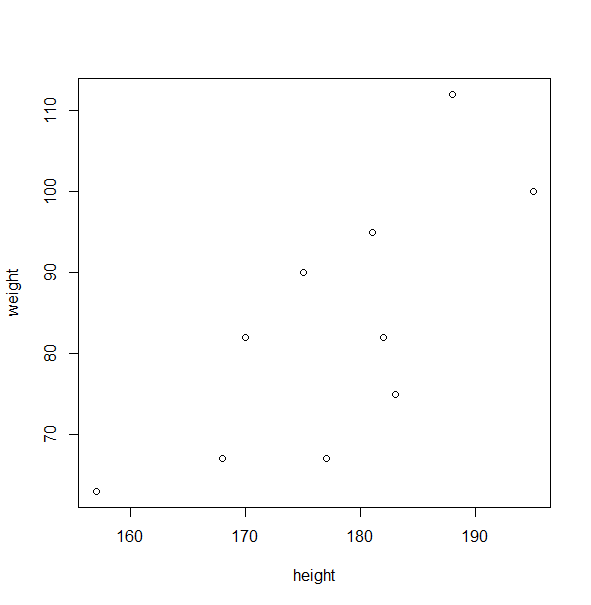
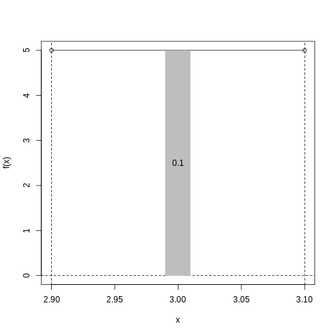
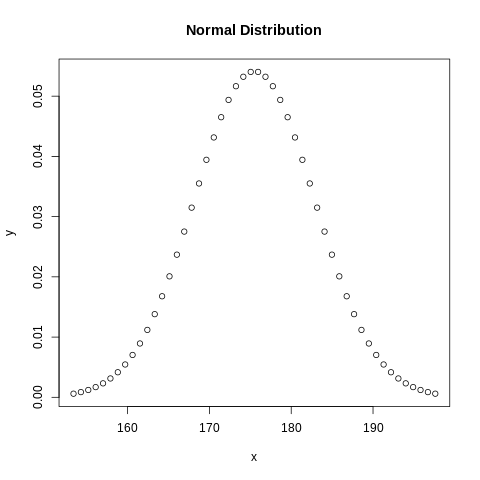
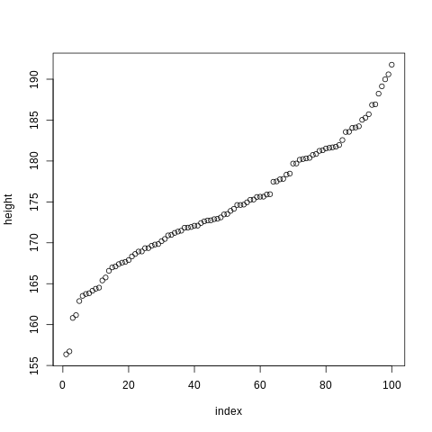
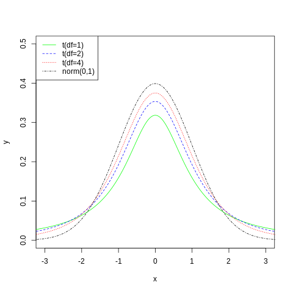
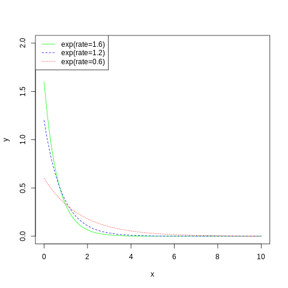

# Statistics

## Basic Terms

- raw data: records or observations that make up a sample
- numeric variables
    - continuous: weight of a person, distance between two points
    - discrete: number of coin tosses, population of a village
- categorial variables
    - nominal (unranked categories): color, nationality
    - ordinal (ranked categories): level (low, medium, high)
- univariate data: only one dimension (weight, length, duration etc.)
- multivariate data: more than one dimension (latitude/longitude, x/y position,
  weight/height)
- parameter: characteristic of a population
    - true mean $\mu$
- statistic: characteristic of a sample (drawn from the population)
    - sample mean <span style="text-decoration: overline">$x$</span>

## Summary Statistics

### Mean, Median, Mode

Calculate the mean (arithmetic average) and median (the middle value for a set
with odd length or the mean of the two middle values for a set with an even
length, respectively):

```R
data <- c(1,1,1,2,2,3,3,3,3,4,4,4,4,5,5,6,7,8,8,9)

mean(data) # 4.15
median(data) # 4
```

Calculate the mode (most common value(s) in a set):

```R
mode <- function(v) {
    # convert values to a table (containing the values and the number of
    # occurences for each value))
    t <- table(v)

    # select the table entries with the biggest number of occurences
    m <- t[t == max(t)]

    # return the value with the most occurences as a number
    return(as.numeric(names(m)))
}
mode(data) # 3 4 (the most common values, both occur four times)
```

Apply summarizing functions on a data frame, grouped by an index (see
`?chickwts`, for details):

```R
tapply(X = chickwts$weight, INDEX = chickwts$feed, FUN = mean)
tapply(X = chickwts$weight, INDEX = chickwts$feed, FUN = median)
```

### Quantiles, Percentiles

Calculate the quantile of a vector (0% minimum, 50% median, 100% maximum):

```R
# 100 random numbers from 1 to 10
s <- sample(x = 1:10, replace = TRUE, size = 100) 

quantile(s) # default quantiles: 0%, 25%, 50%, 75% and 100%
quantile(s, prob = c(0, 0.5, 1)) # just 0%, 50% and 100%
quantile(s, prob = seq(from = 0, to = 1, by = 0.1)) # 0%, 10% etcetera
```

Output: 

      0%   25%   50%   75%  100% 
    1.00  3.00  6.00  8.25 10.00 

     0%  50% 100% 
      1    6   10 

     0%  10%  20%  30%  40%  50%  60%  70%  80%  90% 100% 
    1.0  2.0  2.8  3.0  5.0  6.0  7.0  8.0  9.0 10.0 10.0 

From this output, information can be obtained, such as:

- 25% of all the values in the sample are below 3
- 0% of all values in the sample are below or equal to 1.0 (not a single value)
- 100% of all values in the sample are below or equal to 10.0 (all values)

Obtaining the "five-number summary":

```R
summary(sample(x = 1:10, replace = TRUE, size = 100))
```

Output:

    Min. 1st Qu.  Median    Mean 3rd Qu.    Max. 
    1.00    3.00    6.00    5.66    8.00   10.00

### Spread

Observations with different characteristics could have similar or equal means
and medians:

```R
a <- c(1,2,3,10,11,12,19,20,21)
b <- c(7,8,9,10,11,12,13,14,15)

mean(a) # 11
mean(b) # 11
median(a) # 11
median(b) # 11
```

The degree of spread of numeric observations can be measured with variance
(average squared distance) and the standard deviation (the square root of the
variance):

```R
var(a) # 61.5
var(b) # 7.5

sd(a) # 7.842194, same as sqrt(var(a))
sd(b) # 2.738613, same as sqrt(var(b))
```

The interquartile range measures the width of the "middle 50%" of the data :

```R
as.numeric(quantile(a, 0.75) - quantile(a, 0.25)) # 16
IQR(a) # same, but shorter

as.numeric(quantile(b, 0.75) - quantile(b, 0.25)) # 4
IQR(b) # 4
```

### Covariance and Correlation

Two variables can be more or less related to each other:

```R
height <- c(170, 168, 181, 188, 195, 182, 157, 175, 177, 183)
weight <- c(82, 67, 95, 112, 100, 82, 63, 90, 67, 75)
plot(height, weight)
```



Calculate the covariance (how much two variables "change together") and the
correlation (identify the direction and strength of the covariance):

```R
cov(height, weight) # 128.3556, positive linear relationship
cor(height, weight) # 0.7424948, strong correlation, close to one
```

If the points in the plot would align to a straight line, the correlation would
be exactly 1.

## TODO: Probability

## Probability Distributions

R offers four types of functions for probability distributions, using a
one-letter prefix:

- 'd' functions: providing specific probability values
- 'p' functions: providing cumulative probability values
- 'q' functions: providing quantiles (reverse function of the 'p' function)
- 'r' functions: providing random values

### Mass Functions (for Discrete Variables)

#### Binomial Distribution

The probability of getting $n$ out of $x$ when $p(n)$ is given.

Example: Roll a die (probability of $1/6$ of getting a certain value):

```R
# getting the desired value 5 times (x) when rolling a die 10 times (size)
dbinom(x=5, size=10, prob=1/6) # 0.01302381

# getting the desired value up to five times
sum(dbinom(x=0:5, size=10, prob=1/6) # 0.9975618
pbinom(x=5, size=10, prob=1/6) # same, using the cumulative function

# how many desired values to get with a given probability of 50%
qbinom(p=0.5, size=10, prob=1/6) # 2

# amount of desired values after 10 die rolls (run n=5 random experiments)
rbinom(n=5, size=10, prob=1/6) # 3 1 0 1 3 (for example)
```

#### Poisson distribution

The probability of making $x$ observations when, on average, there are $λ$
observations.

Example: Probability of getting a certain amount of defects in a production
series:

```R
# the probability of getting 10 defects (for an average of 7 defects)
dpois(x=10, lambda=7) # 0.07098327

# the probability of getting up to 10 defects (for an average of 7 defects)
ppois(q=10, lambda=7)

# how much defects to expect in the best 10% (p=0.1) of the production line
qpois(p=0.1, lambda=7) # 4

# how many defects every product will have (run n=10 random experiments)
rpois(n=10, lambda=7) # 9 6 9 7 4 4 5 8 9 9 (for example)
```

#### Geometric Distribution

The numbers of failures to expect before the first success.

Example: Toss a coin (probability = $1/2$), expecting head, calculating the
probability of first getting $x$ times tails:

```R
# getting three tails before getting one head
dgeom(x=3, prob=1/2) # 0.0625

# getting up to three tails before getting one head
pgeom(q=3, prob=1/2) # 0.9375

# in ninety percent of the cases, 3 or less tails occur before the first head
qgeom(p=0.9, prob=1/2) # 3

# how many tails to expect before the first head (run n=10 experiments)
rgeom(n=10, prob=1/2) # 1 0 0 2 1 0 0 0 0 4 (for example)
```

#### Negative Binomial Distribution

Generalized version of the geometric distribution with an additional size
parameter.

Example: Toss a coin (probability = $1/2$), calculate the chance of getting a
specific number of tails ($x$) before a specific number of heads:

```R
# one failure (x=1) before the first (size=1) success
# first throw tails and then head
dnbinom(x=1, size=1, prob=1/2) # 0.25
# four possible outcomes: HT, TH, HH and TT.
TH is one ouf those four, hence 1/4=0.25

# up to one failure (q=1) before the first (size=1) success
# first throw head or tails and then head
pnbinom(q=1, size=1, prob=1/2)
# four possible outcomes: HT, TH, HH and TT.
# HT, HH (no failure) and TH (one failure) are 3 out of 4, hence 3/4=0.75

# in ninety percent of the cases, 3 or less tails occur before the first head
qnbinom(p=0.9, size=1, prob=1/2)

# how many tails to expect before the first head (run n=10 experiments)
rnbinom(n=10, size=1, prob=1/2) # 0 0 0 1 1 1 0 0 0 0 (for example)
```

#### Hypergeometric Distribution

Sampling without replacement, when events have an impact on the probabilities
of upcoming events.

Example: A urn is filled $m=10$ white and $n=90$ black balls ($m+n=100$ balls):

```R
# x: number of white balls drawn (whitout replacement)
# m: total number of white balls in the urn
# n: total number of black balls in the urn
# k: number of balls to be drawn from the urn

# getting one white ball when drawing ten times
dhyper(x=1, m=10, n=90, k=10) # 0.4079953

# getting zero or one white ball when drawing ten times
phyper(q=1, m=10, n=90, k=10) # 0.7384715

# in 95% of the cases, 3 or less white balls will be drawn
qhyper(p=0.95, m=10, n=90, k=10) # 3

# how many white balls expected to be drawn (run nn=10 experiments)
rhyper(nn=10, m=10, n=90, k=10) # 2 1 1 1 2 2 1 0 1 0
```

#### Multinomial Distribution

Generalized version of the binomial distribution. A success can happen in more
than one category at each trial.

Example: Throw a rigged coin with a heavier heads side, see how probable a
certain outcome is:

```R
# rigged coin, head twice as probable as tails
probs <- c(2/3, 1/3) 

# expecting six heads and three tails
outcome <- c(6, 3) # 3 heads, 2 tails

# calculate the odds of that exact outcome
dmultinom(x=outcome, size=sum(outcome), prob=probs) # 0.2731291

# what head/tails ratio to expect when running n=5 experiments with 5 tosses
rmultinom(n=5, size=sum(outcome), prob=probs) # returns a matrix
```

Output of the matrix:

          [,1] [,2] [,3] [,4] [,5]
     [1,]    7    8    6    8    8
     [2,]    2    1    3    1    1

### Density Functions (for Continuous Variables)

#### Uniform Distribution

The uniform distribution has a constant value between a defined interval and the
value zero outside that interval. The width (the interval) and the height (the
value within the interval) multiply to 1.

Example: A machine cuts off pieces between 2.9 and 3.1 centimeters.

```R
# the piece is cut off at exactly 3 cm length
dunif(x=3, min=2.9, max=3.1) # 5
``` 

The result 5 is not a probability, of course, but the function value. In order
to calculate the probability, the area of an interval must be calculated:

```R
# the interval of possible outcomes
a <- 2.9
b <- 3.1

# the interval of desired outcomes
l <- 2.99
r <- 3.01

# calculate the height: any value within the interval will do
h <- dunif(x=3, min=a, max=b)

# plot the interval function
plot(x = c(a, b), y = c(h, h), type="o",
     xlim = c(a, b), ylim=c(0, h),
     xlab="x", ylab="f(x)") 

# draw the borders
abline(h=0, lty=2)
abline(v=a, lty=2)
abline(v=b, lty=2)

# draw a polygon denoting the desired interval
polygon(x=c(r, r, l, l), y=c(h, 0, 0, h),
        col="gray", border=NA)

# calculate the area of the polygon and display it
area <- round(h * (r - l), digits=3)
text(x = 3, y = h/2, area)
```

So the probability of the piece cut off between 2.99 and 3.01 is 10%.



The same calculation can be achieved easier with the `punif` function, which
operates on intervals (and calculates the resulting area):

```R
# the area from the lower interval (a) to the upper desired interval
area_a_to_r <- punif(q=3.01, min=2.9, max=3.1)

# the area from the lower interval (a) to the lower desired interval
area_a_to_l <- punif(q=2.99, min=2.9, max=3.1)

# the desired interval is the difference between those two areas
area = area_a_to_r - area_a_to_l # 0.1
```

Calculating the range that will result with a certain probability:

```R
a <- 2.9
b <- 3.1

# in 95% of the cases, the piece will be cut off at 3.09 cm maximum
qunif(p=0.95, min=a, max=b) # 3.09

# in 95% of the cases, the piece will be cut off at 2.91 cm mininum
qunif(p=1-0.95, min=a, max=b) # 2.91 
```

Calculate $n$ random values in the given range:

```R
l <- runif(n=10, min=2.9, max=3.1)
round(l, digits=3)
# 2.930 2.945 2.979 2.939 3.086 2.990 3.025 2.993 2.920 3.021 (for example)
```

#### Normal Distribution

Describes a bell-shaped distribution curve, which is also known as "Gaussian",
and is often to describe distributions in nature. The curve is symmetric,
unimodal, and the area below it adds up to 1, and the tails are asymptotic to
the x axis.

Example: The height of a person (male) follows a normal distribution with a mean
of 175.5 cm and a standard deviation of 7.37 cm:

```R
height_mean <- 175.5
height_sd <- 7.37

delta <- 3 * height_sd
x <- seq(from=height_mean-delta, to=height_mean+delta, length=50)
y <- dnorm(x, mean=height_mean, sd=height_sd)
plot(x, y, main="Normal Distribution")
```



The points are evenly spread on the x-axis, but not so on the y-axis.

To obtain a probability value, the area below the curve and inside an interval
has to be calculated:

```R
height_mean <- 175.5
height_sd <- 7.37

# calculate the probability of a value within one standard deviation
low <- height_mean - height_sd
high <- height_mean + height_sd
area_left <- pnorm(q=low, mean=height_mean, sd=height_sd)
area_right <- pnorm(q=high, mean=height_mean, sd=height_sd)
area <- area_right - area_left # 0.6826895

# calculate the probability of a value within two standard deviations
low <- height_mean - 2 * height_sd
high <- height_mean + 2 * height_sd
area_left <- pnorm(q=low, mean=height_mean, sd=height_sd)
area_right <- pnorm(q=high, mean=height_mean, sd=height_sd)
area <- area_right - area_left # 0.9544997

# calculate the probability of a value within three standard deviations
low <- height_mean - 3 * height_sd
high <- height_mean + 3 * height_sd
area_left <- pnorm(q=low, mean=height_mean, sd=height_sd)
area_right <- pnorm(q=high, mean=height_mean, sd=height_sd)
area <- area_right - area_left # 0.9973002
```

The calculated probabilities summarized:

- around 66% of all values are within _one_ standard deviation
- around 95% of all values are within _two_ standard deviations
- around 99% of all values are within _three_ standard deviations

Obtaining quantiles, the cut-off points of a given probability can be
calculated:

```R
height_mean <- 175.5
height_sd <- 7.37

# calculating a height that marks the cut-off point of the lowest 10%
qnorm(p=0.1, mean=height_mean, sd=height_sd) # 166.055

# calculating a height that marks the cut-off point of the lowest 90%
qnorm(p=0.9, mean=height_mean, sd=height_sd) # 184.945
```

Create some random, normally distributed values:

```R
height_mean <- 175.5
height_sd <- 7.37

heights <- rnorm(n=100, mean=height_mean, sd=height_sd)
plot(sort(heights), xlab="index", ylab="height")
```



The values are roughly aligned on a straight line, with outliers at the left
bottom and at the right top.

#### Student's t Distribution

A bell-shaped distribution curve for samples (rather than populations) and an
area of 1 below the curve; a family of curves getting closer to the normal
distribution when rising it's sole parameter -- the _degrees of freedom_ ($df$):

```R
x <- seq(from=-10, to=10, length=1000)
a <- dt(x=x, df=1)
b <- dt(x=x, df=2)
c <- dt(x=x, df=4)
n <- dnorm(x = x, mean=0, sd=1)

plot(x=NA, type="n", xlim=c(-3,3), ylim=c(0,0.5), xlab="x", ylab="y")
lines(x=x, y=a, lty=1, col="green")
lines(x=x, y=b, lty=2, col="blue")
lines(x=x, y=c, lty=3, col="red")
lines(x=x, y=n, lty=4, col="black")
legend(x="topleft",
       legend=c("t(df=1)", "t(df=2)", "t(df=4)", "norm(0,1)"),
       lty=c(1,2,3,4), col=c("green", "blue", "red", "black"))
```



Its functions (`dt`, `pt`, `qt` and `rt`) are applied similarly to the ones of
the normal distribution.

#### Exponential Distribution

The exponential distribution describes a curve with $x$ values from 0 to
positive infinity with (exponentially) falling $y$ values, starting from a value
defined as the rate parameter. The area below the curve is always 1. The bigger
the rate parameter, the higher the starting point and the faster the decay:

```R
x <- seq(from=0, to=10, length=1000)
a <- dexp(x=x, rate=1.6)
b <- dexp(x=x, rate=1.2)
c <- dexp(x=x, rate=0.6)

plot(x=NA, type="n", xlim=c(0,10), ylim=c(0,2), xlab="x", ylab="y")
lines(x=x, y=a, lty=1, col="green")
lines(x=x, y=b, lty=2, col="blue")
lines(x=x, y=c, lty=3, col="red")
legend(x="topleft",
       legend=c("exp(rate=1.6)", "exp(rate=1.2)", "exp(rate=0.6)"),
       lty=c(1,2,3), col=c("green", "blue", "red"))
```



The rate parameter is also called $λ$, hinting at the close relation to the
Poisson distribution: The Poisson distribution models the _count_ of a certain
event, the exponential distribution the _time between_ the events. Example:
Every hour, 90 cars pass a bridge (a rate of $90/60=1.5$ per minute).

```R
# after one car has just passed, calculate the probability of ...

# ... a car passing within the next minute (q=1)
pexp(q=1, rate=1.5) # 0.7768698

# ... no car passing for the next two minutes (q=2)
1 - pexp(q=2, rate=1.5) # 0.04978707

# the cut-off point for the lowest 10% of waiting time
qexp(p=0.1, rate=1.5) # 0.07024034 minutes, roughly 4.2 seconds

# the cut-off point for the highest 10% of waiting time
qexp(p=0.9, rate=1.5) # 1.535057 minutes, roughly 92 seconds
```

#### Other Density Distributions

Other densitiy distributions and their functions:

- Chi-squared distribution: models sums of squared normal variates
    - Functions: `dchisq`, `pchisq`, `qchisq` and `rchisq`
- F distribution: models rations of two chi-squared random variables
    - Functions: `df`, `pf`, `qf` and `rf`
- Gamma distribution: generalization of exponential and chi-squared distributions
    - Functions: `dgamma`, `pgamma`, `qgamma` and `rgamma`
- Beta distribution: for Bayesian modeling
    - Functions: `dbeta`, `pbeta`, `qbeta` and `rbeta`

