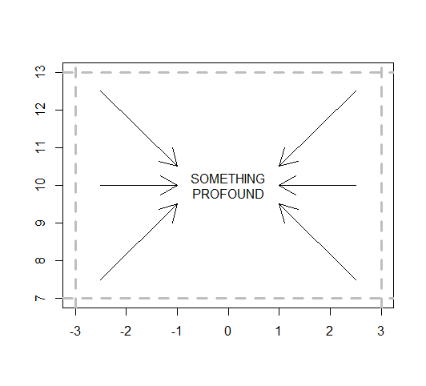
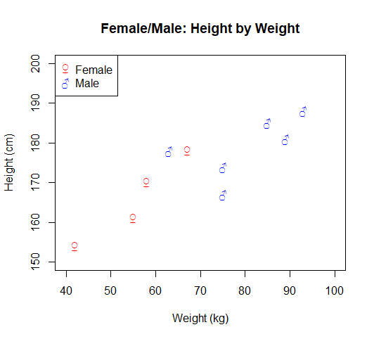
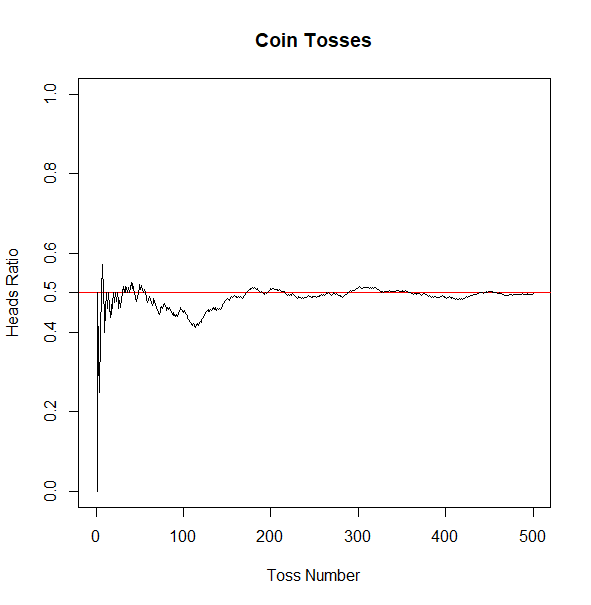

# Plotting

Simple plots can be drawn using two vectors of x and y coordinates of the same
length:

    x <- c(3, 2, 7, 8)
    y <- c(2, 5, 6, 1)
    plot(x, y)

When using matrices for plotting, the first column holds the x values, and the
second column holds the y values:

    m <- matrix(1:4, ncol = 2)

    1   3   # point (1;3)
    2   4   # point (2;4)

    plot(m)

When using a single vector for plotting, each value serves as the x and the y
coordinate at the same time:

    plot(1:3) # plots (1;1), (2;2), (3;3)

Plots can be (optically) enhanced using various options:

- `type`: the plotting style, a single character
    - `"p"`: points
    - `"l"`: lines
    - `"b"`: both (points and lines)
    - `"c"`: empty points joined by lines
    - `"o"`: overplotted points and lines
    - `"s"`: stair steps (lower Riemann areas)
    - `"S"`: stair steps (upper Riemann areas)
    - `"n"`: none
- `main`: the main title of the plot, characters
- `xlab`, `ylab`: labels for the x and y axis, characters
- `pch`: the character to be used to draw the dots, either a number from 1 to 25
  (pre-defined styles) or any single character
- `cex`: character expansion, stretches the point by the given factor, a number
- `lty`: the line type (`"solid"`, `"dotted"` or `"dashed"`)
- `lwd`: the line width, a number
- `xlim`, `ylim`: horizontal and vertical ranges as vectors (`c(lower, upper)`)
- `col`: the color for the dots/lines, either a color name, a number (from 1 to
  8) or a hex code (like `#ffffff` for white)

## Additional Elements

Calling the `plot()` function always creates a new output and removes the old
one. Elements can be added to an existing plot using these functions:

    lines(x = c(1, 3, 2), y = c(3, 1, 2))
    # plots a line connecting P(1;3), P(3;1) and P(2;2)

    points(x = c(1, 3, 2), y = c(3, 1, 2))
    # plots the points P(1;3), P(3;1) and P(2;2)

    text(x = 5, y = 3, "Nothing") # the text "Nothing" centered around P(5;3)

    arrows(x0 = 1, y0 = 2, x1 = 4, y1 = 7)
    # draws an arrow pointing from P(1;2) to P(4;7)

    abline(a = 2, b = 3) # line with the slope 2 and y intercept 3 (P(0;3), that is)

    abline(h = 2) # a horizontal line on y = 2
    abline(v = 1) # a vertical line on x = 1

    segments(x0 = c(1, 4), y0 = c(1, 1), x1 = c(1, 4), y1 = c(5, 5))
    # two vertical lines from P(1;1) to P(1;5) and from P(4;1) to P(4;5)

    legend(x = "bottomleft", legend = c("Male", "Female"), pch = c("+", "x"))
    # a legend on the bottom left position (+: Male, x: Female)

## TODO: Barplots

## TODO: Pie Charts

## TODO: Histograms

## TODO: Box-and-Whisker Plots

## TODO: Scatterplots

## Saving Plots to Files

Plots can be saved to files. Various formats are supported, for example PNG,
JPEG, TIFF, BMP, PDF and EPS (postscript). Plotting to a screen is a special
case of plotting: it draws directly on the screen device. Files are handled as
devices, too..

In order to save a plot to a file, just open the file device, do the plots and
close the device:

    png(filename = "plot.png")
    plot(1:10, 2:11)
    dev.off()

The dimensions are 480x480 pixels by default, but can be overwritten:

    png(filename = "plot.png", width = 800, height = 600)

Other units than pixels can be used when providing the DPI resolution:

    png(filename = "plot.png", width = 9, height = 8, units = "cm", res = 300)

For postscript and PDF output, the default unit is inches -- and the filename
parameter is called `file`:

    pdf(file = "plot.pdf", width = 8, height = 6)

For SVG output, parameters such as the font and the background can be defined:

    svg(filename = "plot.svg", family = "serif", bg = "grey")

## Plotting Examples

### Example 1: Drawing Features

```R
plot(x = c(), xlim = c(-3, 3), ylim = c(7, 13), xlab="", ylab="")
abline(v = c(-3,3), h = c(7,13), lty = "dashed", col = "grey", lwd = 3)
x0 = c(-2.5, -2.5, -2.5, 2.5, 2.5, 2.5)
y0 = c(7.5, 10, 12.5, 12.5, 10, 7.5)
x1 = c(-1, -1, -1, 1, 1, 1)
y1 = c(9.5, 10, 10.5, 10.5, 10, 9.5)
arrows(x0, y0, x1, y1)
text(x = 0, y = 10, "SOMETHING\nPROFOUND")
```

 

### Example 2: Colored Graph and Legend

```R
fw <- c(55, 42, 58, 67)
fh <- c(161, 154, 170, 178)
mw <- c(85, 75, 93, 63, 75, 89)
mh <- c(185, 174, 188, 178, 167, 181)
plot(x = c(), main = "Female/Male: Height by Weight",
    xlab = "Weight (kg)", ylab = "Height (cm)",
    xlim = c(40, 100), ylim = c(150, 200))
points(fw, fh, pch = "♀", col = "red")
points(mw, mh, pch = "♂", col = "blue")
legend(x = "topleft", legend = c("Female", "Male"),
    pch = c("♀","♂"), col = c("red", "blue"))
```



### Example 3: Law of Large Numbers

```R
nTosses <- 500

## toss the coin, get head ("H") or tails ("T")
tosses <- sample(c('H', 'T'), size = nTosses, replace = TRUE)

v <- rep(0, length(tosses))
heads <- data.frame(tossNumber = v, headCount = v, headRatio = v)

for (n in 1:length(v)) {
  h <- 0
  for (i in 1:n) {
    if (tosses[i] == 'H') {
      h <- h + 1
    }
  }
  heads$tossNumber[n] = n
  heads$headCount[n] = h
  heads$headRatio[n] = heads$headCount[n] / n
}

plot(x = c(), type = "l", xlim = c(0, nTosses), ylim = c(0,1),
    main = "Coin Tosses", xlab = "Toss Number", ylab = "Heads Ratio")
abline(h = 0.5, col = "red")
lines(x = heads$tossNumber, y = heads$headRatio)
axis(side = 2, at = c(0.5))
```



## Pre-Installed Data Sets

R comes with of pre-installed data sets, which can be listed:

    library(help = "datasets")

To get more information about one of the data sets listed, just use the help
function:

    ?Titanic # Survival of passengers on the Titanic

Other data sets can be installed just like packages, for example the `tseries`
package:

    install.packages("tseries")

Load the `ice.river` data set into the current workspace:

    data(ice.river)

Now the `ice.river` data set can be accessed and explored like any variable.

A good resource for free statistical example data is the [Journal of Statistics
Education (JSE)](https://ww2.amstat.org/publications/jse/jse_data_archive.htm).

